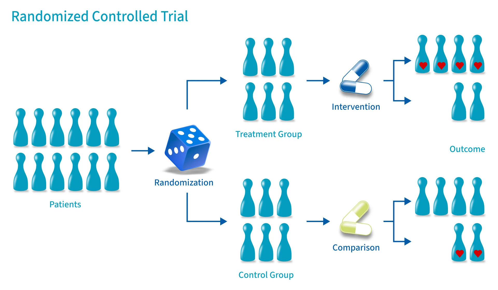
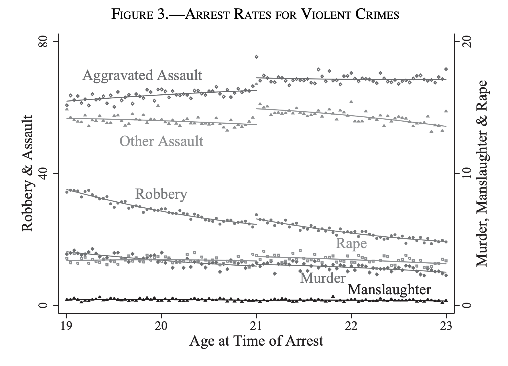
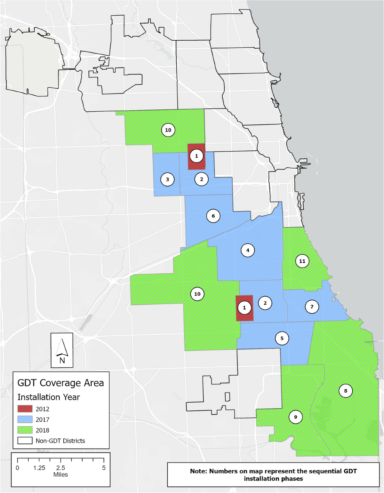
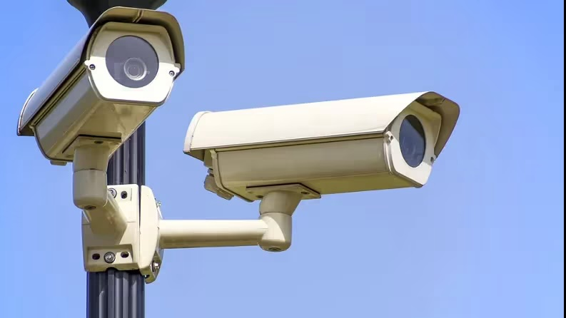
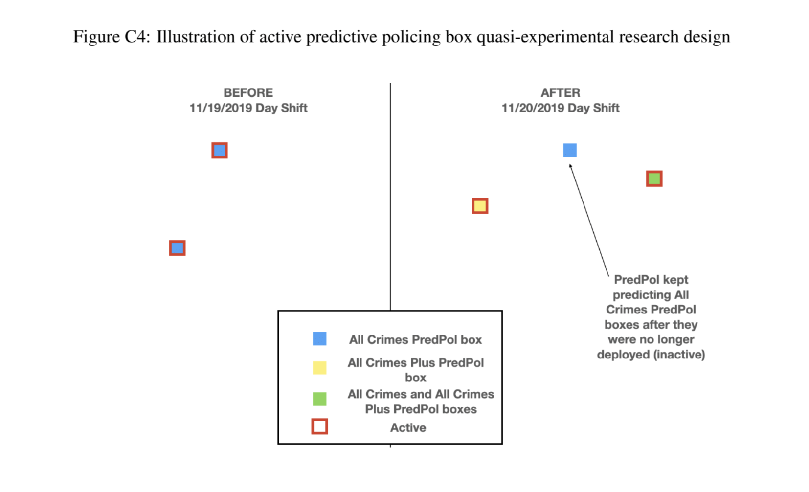
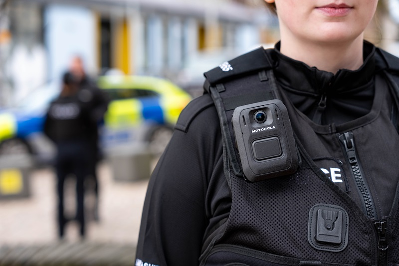
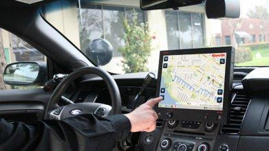
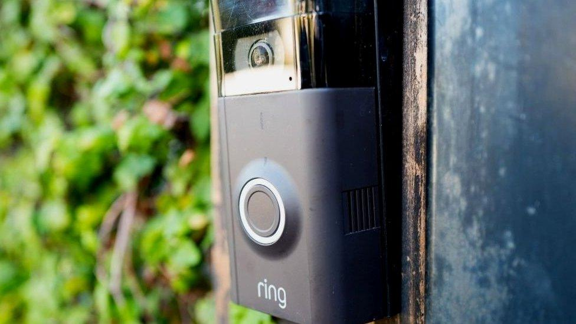

<style type="text/css">
.remark-slide-content {
    font-size: 25px;
    padding: 1em 4em 1em 4em;
}
</style>
```{r setup, include=FALSE}
library(kableExtra)
library(xaringanExtra)
options(htmltools.dir.version = FALSE)
knitr::opts_chunk$set(echo = F,  message = F, warning = F,
                      fig.asp = 9/16,
  fig.align = 'center',
  echo = F,
  out.width = "100%",
  dpi= 300)
# knitr::opts_knit$set(root.dir = rprojroot::find_rstudio_root_file())
```
```{js}
$( document ).ready(function() {
  $(".lightable-classic").removeClass("table").css("display", "table");
});
```


```{css, echo = F}

.red {
  font-weight: bold;
  color: red;
}
/* This changes any table of class regression to 20 size font */
.regression table {
  font-size: 20px; 
  width: 100%;
  background-color: transparent;
  border: none;
  border-spacing: unset;
}

table > :is(thead, tbody) > tr > :is(th, td) {
  padding: 3px;
  text-align: left;
  background-color: transparent;
}
table > thead > tr > :is(th, td) {
  border-top: 2px solid;
  border-bottom: 1px solid;
  background-color: white;
}
table > tbody > tr:last-child > :is(th, td) {
  border-bottom: 2px solid;
  background-color: white;
}
table > tfoot > tr > :is(th, td) {
  padding: 0; /* Set padding to 0 for tfoot cells */
  background-color: white;
}

table > tfoot > tr {
  background-color: transparent !important; /* Remove background stripes from tfoot rows */
}


/* This removes the odd-even shade on tables */
.remark-slide thead, .remark-slide tr:nth-child(2n) {
        background-color: white;
    }
```


```{r xaringan-panelset, echo=FALSE}

## this code enables the use of panels inside of the presentation
xaringanExtra::use_panelset()
xaringanExtra::style_panelset_tabs(active_foreground = "blue", background = "white", font_family = "Fira Sans", 
                                   inactive_opacity = 0.5)

```


# Motivation

.pull-left[
### Technology in Police Departments:
  - Substitutes $\rightarrow$ License plate readers, facial recognition 
  - Complements $\rightarrow$ predictive 'hotspot' policing 
  - Technology changes functionality]

--

.pull-right[
### Main Issue:
  - Technologies implemented w/o evaluation
  - Unintended consequences, we did not foresee?
  - Benefits outweight the costs?
]

--

### <font color="blue">**Objective of this Presentation**</font>: 
### How can we rigorously evaluate these technologies to understand their effects on crime/policing?

* Overview of technologies: know/don't know/want to know/how to evaluate.

---
# How can we find causal effects?

## Thought Experiment: 
- In a perfect world, how would we experimentally find whether X causes Y?

--

.center[ .font120[ <font color="blue">**Random assignment of the treatment is the key to causal effects** </font>]]

--
.pull-left[
### Randomized Control Trials (RCT)
- The Gold Standard
- Pilot Programs
- Problem: Expensive, direct collaboration, bias of who selects in.
     - What happens at scale?
]
--
.pull-right[
### Natural Experiments
- A great alternative; leverages randomness in the world
- Trade off: less expensive, more potential for confounders
- Departments may already be doing this!

]

---
# Examples of how to find causal effects

.panelset[
.panel[.panel-name[Randomized Control Trial]
.pull-left[
### Construct a lab
- Randomly assign a population to a treated group and control group
- Randomness of treatment assignment allows for causal effects
  - Average out differences in treatment and control
- Example: pilot studies, randomly assign treatment to one group, and not another one
]

.pull-right[
### A perfect experiment:
```{r}

```
]
]


.panel[.panel-name[Regression Discontinuity]

.pull-left[
### How do we get randomness necessary for causal effects?
- Leverage an arbitrary cutoff 
  - Intuition: compare individuals slightly above and slightly below the cutoff
- Example: Passing minimum legal drinking age results in more arrests
- Requires many observations

]

.pull-right[

```{r}

```
]
]

.panel[.panel-name[Difference-in-Differences]
.pull-left[
### How do we get randomness necessary for causal effects?
- Timing of when assignment of treatment occurs
- Intuition: Compare the trends of treated places to untreated places
- Example: Adoption of gunshot detectors at different points
- Can be hard to isolate if many changes
]

.pull-right[

```{r, out.width = "70%"}

```
]
]
]

---
# Getting causal effects in crime setting

## What makes studying crime particularly challenging?

--

.pull-left[
### Challenge 1: Measurement
 - Changes in reporting
 - Example: Streetlights and 911 calls
]

--

.pull-right[
### Challenge 2: Changes
- New tech -> new policies coincide
]

--

.pull-left[
### Challenge 3: Data 
- Freedom of Information Acts (FOIA)
  - Downfall: Costly, slow, inefficient
- Collaborations are easier!

]

--

.pull-right[
### Challenge 4: Finding collaborators
- Collaborators are great but how to find them?
  - Cold calling does not work
]


---
class: inverse, mline, center, middle

# Automation of Reporting 

Motivation: Reduce reliance on civilians and police staffing
---
# Automation of Reporting

### How have we studied it?

- Traffic Cameras
  - Reduced red-light running (Wong 2014)
  - Trade-off: increased rear-ending (Wong 2014, Gallager and Fisher, 2020)
- Automated Gunshot Technology
  - 12% of gunfire goes reported (Carr and Doleac, 2018)
  - Measure of police mistrust (Ang et. al, 2021)

.pull-left[
### What can we still learn?
- Facial recognition
  - Increase deterrence?
  - Requires knowledge; cilivian pushback
]

.pull-right[
```{r, out.width = "75%"}

```
]

---
class: inverse, mline, center, middle

# Predictive Policing

Motivation: Prevention and Deterrence of Crime

---
# Patrol Software and Risk Scores

### Have we studied it?

- Assisting patrols (Hunchlab/PredPol/KeyStats):
  - Increases in clearance rates (Mastrobuoni, 2020)
  - Decreases serious violent/property crimes (Jabri, 2023)
  - Evidence of some officers not taking suggestions (Kapustin et al. 2022)
- Algorithmic risk scores/prediction of victims:
  - Good candidates for regression discontinuity!
  - Effective in finding at-risk victims and can prevent victimization (Heller
et al., 2024)
  - Could bake-in bias (Angwin et al., 2016; Lum and Isaac, 2016; Richardson et al., 2019; Mehrabi et al., 2021, Jabri, 2023)

### What can we still learn?

- Do criminals get smarter? Spillovers, criminals acting more randomly?
- How can we motivate officers to take the suggestions?

---
# Case Study: Jabri 2023

.pull-left[
### The natural experiment:
- PredPol technology: unexpected change in how the 'hotspot' boxes are created
- Comparison: can old predictive boxes (control), and new predictive boxes (treatment)
]

.pull-right[
```{r}

```
]

### Results:
- Decreases serious violent and property crimes
- Exacerbates racial disparities in arrests in traffic incidents and
serious violent crime
---
class: inverse, mline, center, middle
# Police Oversight:

Motivation: Increase policing accountability to change behavior


---
# Body-Worn Cameras

.pull-left[
### How have we studied it?

- RCTs: Mixed evidence on use-of-force; Null (Yokum et. al, 2019) Significant reductions (Braga et. al, 2018)
- Difference-in-Differences
  - Lower complaints (Ferrazares, 2024), police-involved homicides (Kim, 2024)
]

.pull-right[
```{r}

```
]

### What could be done?
- Videos = untapped data source; source of measurement, senitment, citizen relations
- Truleo (new!): Uses AI to automate transcripts/sentiment of officer
  - Upcoming studies (Adams et al., 2024)


---
# GPS Trackers

.pull-left[
### Have we studied it?

- Difficult to get high-frequency data
- Descriptive work: Smartphone data (Chen et al., 2023)
  - Officers patrol in high Black density more, controlling for crime/density/demand
  
]

.pull-right[
```{r}

```

]
### What we still learn?

- Can these be used to increase oversight?
  - CCTV cameras shown to stop officers from shirking in India (Conover et al., 2023)
- Can these be used to improve data quality?
  - Example: improve 911 response time reporting

---
class: inverse, mline, center, middle

# Police Response: 

Motivation: Reactive policing


---
# Automated Gunshot Technology

### How have we studied it?
- Difference-in-Differences 
- No clear evidence of reductions in crime (Manes, 2021; Ferguson and Witzburg, 2021; Connealy et al., 2024, Topper and Ferrazares, 2024)
- Evidence of better locational accuracy (Piza et al., 2023), faster gun-related dispatch (Choi et al., 2014)
- High trade-off in resource-constrained environment (Topper and Ferrazares, 2024)


### What can we still learn?

- Does this help gunshot victims? (Upcoming work)
  - Do benefits outweigh costs?
- Can we leverage this data for other purposes?
  - Ex: Better method of understanding crime (Carr and Doleac, 2018)


---
class: inverse, mline, center, middle

# Information Technology:

Motivation: More information can increases likelihood of criminal being caught


---
# Ring Doorbells

.pull-left[
### Have we studied it?

- Only study: attempts to create a Ring map in LA (Calacci et al., 2022)
  - Descriptively does not find much evidence of crime reduction
]

.pull-right[


```{r, fig.align="center"}

```
]

### What can we still learn?

- Need collaborators and data!
- Could utilize timing of Ring rollouts for a natural experiment
  - Discontinuity in city boundaries on legality?
- Deterrence effects? Increase in clearance rates?

---
# Main takeaways

## Policing technology can be effective
- We can study it causally by using:
  - Randomized Control Trials
  - Natural Experiments


## How should we implement?

- Thoughtful evaluation considering costs/benefits first
  - ShotSpotter creating a costly trade-off
  - Traffic cameras change composition, but not total accidents
  - PredPol decreasing crime, but increasing racial discrimination
  
---
# Solutions to challenges in causal crime analysis:

--

.pull-left[
### Challenge 1: Measurement
 - Leverage technological data sources
 - Ex: ShotSpotter, Truleo, GPS tracking

]

--

.pull-right[
### Challenge 2: Changes
- Implement changes progressively, rather than immediately
- Proposition: transparency with operating procedures and changes
]

--

.pull-left[
### Challenge 3: Data 
- Open Data has been a big success
- Bypass the FOIA process
- Negotiate contracts with firms to allow open data


]

--

.pull-right[
### Challenge 4: Finding collaborators
- If you build it, they will come
- Post information; point-of-contact
- Young scholars will (likely) do it for free
]

---
class: inverse, mline, center, middle

# Thank you

