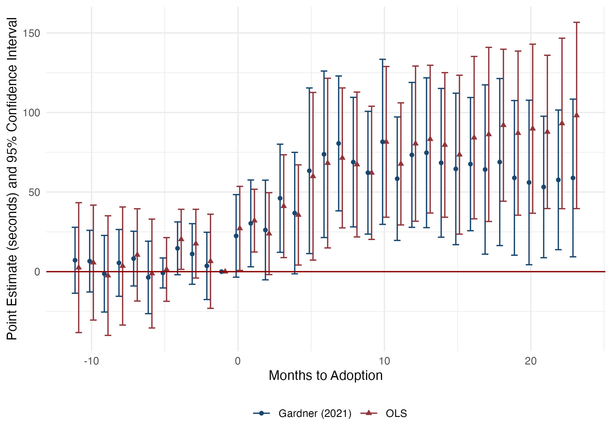

class: inverse, mline, center, middle
<style type="text/css">
.remark-slide-content {
    font-size: 25px;
    padding: 1em 4em 1em 4em;
}
</style>
```{r setup, include=FALSE}
library(kableExtra)
library(xaringanExtra)
options(htmltools.dir.version = FALSE)
knitr::opts_chunk$set(echo = F,  message = F, warning = F,
                      fig.asp = 9/16,
  fig.align = 'center',
  echo = F,
  out.width = "100%",
  dpi= 300)
# knitr::opts_knit$set(root.dir = rprojroot::find_rstudio_root_file())
```
```{js}
$( document ).ready(function() {
  $(".lightable-classic").removeClass("table").css("display", "table");
});
```


```{css, echo = F}

.red {
  font-weight: bold;
  color: red;
}
/* This changes any table of class regression to 20 size font */
.regression table {
  font-size: 20px; 
  width: 100%;
  background-color: transparent;
  border: none;
  border-spacing: unset;
}

table > :is(thead, tbody) > tr > :is(th, td) {
  padding: 3px;
  text-align: left;
  background-color: transparent;
}
table > thead > tr > :is(th, td) {
  border-top: 2px solid;
  border-bottom: 1px solid;
  background-color: white;
}
table > tbody > tr:last-child > :is(th, td) {
  border-bottom: 2px solid;
  background-color: white;
}
table > tfoot > tr > :is(th, td) {
  padding: 0; /* Set padding to 0 for tfoot cells */
  background-color: white;
}

table > tfoot > tr {
  background-color: transparent !important; /* Remove background stripes from tfoot rows */
}


/* This removes the odd-even shade on tables */
.remark-slide thead, .remark-slide tr:nth-child(2n) {
        background-color: white;
    }
```


```{r xaringan-panelset, echo=FALSE}

## this code enables the use of panels inside of the presentation
xaringanExtra::use_panelset()
xaringanExtra::style_panelset_tabs(active_foreground = "blue", background = "white", font_family = "Fira Sans", 
                                   inactive_opacity = 0.5)

```

# Chapter 1: The Unintended Consequences of Policing Technology: Evidence from ShotSpotter
with Toshio Ferrazares

---
# Motivation

.pull-left[
### Technology in Police Departments:
  - Substitutes $\rightarrow$ License plate readers, facial recognition 
  - Complements $\rightarrow$ predictive 'hotspot' policing 
  - Technology changes officer time allocation]

--

.pull-right[
### ShotSpotter Technology
  - Gunshot detection
  - Rationale: only 12% of gunfire reported (Carr and Doleac, 2017) $\rightarrow$ method to rapidly respond to others 
  - 150+ cities world-wide
]

--

### <font color="blue">**Research Question**</font>: 
### How does the implementation of ShotSpotter technology affect 911 call response times?

* How does a police officer's time allocation change s.t. it affects response?
---
# Why would ShotSpotter affect response times?

.pull-left[
### Resource-Intensive
  - Respond to every detected gunfire 
  - Chicago: ~70 daily dispatches, 20 min.
  - High priority: same as active shooter
  
### Police Scarcity
  - Fixed resources $\Rightarrow$ trade-offs

### Unintended consequences?
 - Ex-ante ambigious; does proximity or time allocation prevail?


]


.pull-right[

```{r, out.width = "500px", out.height = "450px", fig.align="center"}
knitr::include_graphics("figures/macarthurfigure_attempt.jpg")
```

]

---
# Why do we care about response times?

.font120[
> “If police can arrive within one minute of the commission of an offense, they are more likely to catch the suspect. Any later and the chances of capture are very small, probably less than one in ten.”- (David H. Baley 1996) 
]

--

### Evidence
- Lower response times results in
    - Higher crime clearance (Blanes i Vidal and Kirchmaier 2018)
    - Less likelihood of an injury (DeAngelo et al. 2023)
- Rapid response $\rightarrow$ important component of investigation (College of Policing 2013)
- Health implications
    - Delayed treatment $\rightarrow$ worse patient outcomes (Wilde, 2013, Avdic, 2016)


---
# Summary of the Paper


.pull-left[
## Setting:
  - Chicago: 2016-2022
    - 2nd largest police force
    - 3rd largest city

]


---
count: false
# Summary of the Paper


.pull-left[
## Setting: 
  - Chicago: 2016-2022
    - 2nd largest police force
    - 3rd largest city
    
## Data:
 - All dispatched 911 calls for police service
  - Police shifts
  - Arrests
  - Victim injuries
]


---
count: false
# Summary of the Paper


.pull-left[
## Setting: 
  - Chicago: 2016-2022
    - 2nd largest police force
    - 3rd largest city
    
## Data:
 - All dispatched 911 calls for police service
  - Police shifts
  - Arrests
  - Victim injuries
]


.pull-right[
## Empirical Strategy:
  - Staggered difference-in-differences
    - Variation: ShotSpotter rollouts across police districts
  

]


---
count: false
# Summary of the Paper


.pull-left[
## Setting: 
  - Chicago: 2016-2022
    - 2nd largest police force
    - 3rd largest city
    
## Data:
 - All dispatched 911 calls for police service
  - Police shifts
  - Arrests
  - Victim injuries
]

.pull-right[
## Empirical Strategy:
  - Staggered difference-in-differences
    - Variation: ShotSpotter rollouts across police districts
  

## Main Results:
  - When a civilian calls 911, a call experiences:
    - +1 minute Call-to-Dispatch (23%)
    - +2 minutes Call-to-On-Scene (13%)
    - Lower arrest probability (9%)
]

---
# Contribution
### In-depth, causal analysis on the unintended consequences of a wide-spread police technology.

--
#### Related Literature

.panelset.sideways[
.panel[.panel-name[ShotSpotter Specific]
<font color="blue"> We unpack the effects of this wide-spread police technology. </font>
- Economics:
  - Use ShotSpotter as data for alternative crime/mistrust measure (Carr and Doleac 2018; Ang et. al 2021)
- Non-Economics: 
  - Better accuracy, little crime impact or case resolution (Piza et al., 2023; Mares and Blackburn, 2012; Choi et al., 2014)
]
.panel[.panel-name[Police Technology]
<font color="blue"> Unlike others, we find costly unintended consequences of a police technology. </font>
- Benefits of Police Technology:
    - Body Worn Cameras $\rightarrow$ lower use of force/complaints (Zamoff et al. 2021; Braga et al. 2022; Ferrazares 2023)
    - Predictive Policing $\rightarrow$ less crime (Mastrobuoni, 2020; Jabri, 2021; Heller et al., 2022)
    - Tactical Equipment $\rightarrow$ less crime (Bove and Gavrilova 2017; Harris et al. 2017))
]

.panel[.panel-name[Rapid Response]
<font color="blue"> We identify a determinant of higher response times, and can quantify at a micro-level. </font>
- Lower Response Times:
  - Higher crime clearance (Blanes i Vidal and Kirchmaier, 2018)
  - Less likelihood of an injury (DeAngelo et al., 2023)
]

.panel[.panel-name[Technology in Workforce]
<font color="blue"> The results imply that technology not ready to completely replace police officers. </font>
- General Workforce Productivity:
  - Technology is an effective workforce tool (Hoffman et al., 2018, Bhatt et al., 2023)
- Implementation and Allocation:
  - *How* resources allocated $\rightarrow$ important for desired outcomes (Ba et al., 2021; Kapustin et al., 2022a; Rivera and Ba, 2023; Adger et al., 2023)
]
]

---
class: inverse, mline, center, middle
count: false

# Background on Chicago Policing

---
# Chicago Background

.pull-left[
### Chicago Geography:
* Chicago subset into 22 police districts (population ~100k)
  - Within districts are beats
  - Officers generally assigned within districts/beats to patrol

### Chicago Crime:
* Chicago crime is localized 
    - Gun-crime is localized to South/West sides
]

.pull-right[
```{r, out.width = "400px", out.height = "500px"}
knitr::include_graphics("figures/map_911.jpeg")
```
]
---
count: false
# Chicago Background

.pull-left[
### Chicago Geography:
* Chicago subset into 22 police districts (population ~100k)
  - Within districts are beats
  - Officers generally assigned within districts/beats to patrol

### Chicago Crime:
* Chicago crime is localized 
    - Gun-crime is localized to South/West sides
]

.pull-right[
```{r, out.width = "400px", out.height = "500px"}
knitr::include_graphics("figures/map_911_gun.jpeg")
```
]
---
# Policing in Chicago

## Police Officer Responsibilities:
* Patrol, respond to incidents, make arrests/stops, complete written reports
* Gathers info at traffic scenes—preliminary investigation
* Direct traffic
* Appear in court/give testimony

## Police Time Allocation:

> "From the minute you start your shift, radio is non stop calls until backlog. The whole shift you chase radio calls." - CPD Police Officer January 2023 (Indeed.com)

> "Very busy be ready to answer up to 50 calls for service specialy during Summer season." - CPD Police Officer February 2023 (Indeed.com)


---
class: inverse, mline, center, middle
count: false

# 911 Dispatch Procedure in Chicago


---
# 911 Dispatch Procedure

.panelset[

.panel[.panel-name[911 Dispatch Pipeline:]
.center[
.font110[911 call] $\Rightarrow$  .font110[Dispatcher Assigns] $\Rightarrow$  .font110[Officer Travels] $\Rightarrow$  .font110[Officer Arrives]]
]

.panel[.panel-name[Call-to-Dispatch:]

.center[
.font110[<font color = "blue"> <b>911 call </b></font>] $\Large\Rightarrow$  .font110[<font color = "blue"><b>Dispatcher Assigns</b> </font>] $\Large\Rightarrow$  .font110[Officer Travels] $\Large\Rightarrow$  .font110[Officer Arrives]]

#### <font color = "blue"><b>Call-to-Dispatch</b></font>

* Measure of officer availability; officers label themselves as 'available'
]

.panel[.panel-name[Call-to-On-Scene:]
.center[
.font110[<font color = "blue"> <b>911 call </b></font>] $\Large\Rightarrow$  .font110[<font color = "blue"><b>Dispatcher Assigns</b> </font>] $\Large\Rightarrow$  .font110[<font color = "blue"> <b>Officer Travels </b></font>] $\Large\Rightarrow$  .font110[Officer Arrives]]

#### Call-to-Dispatch
* Measure of officer availability; officers label themselves as 'available'

#### <font color = "blue"><b>Call-to-On-Scene</b></font>

* Measure of officer proximity to crime
]
.panel[.panel-name[Arrest Made:]
.center[
.font110[911 call] $\Large\Rightarrow$  .font110[Dispatcher Assigns] $\Large\Rightarrow$  .font110[Officer Travels] $\Large\Rightarrow$  .font110[<font color = "blue"><b>Officer Arrives</b></font>]]

#### Call-to-Dispatch

* Measure of officer availability; officers label themselves as 'available'


#### Call-to-On-Scene

* Measure of officer proximity to crime

#### <font color = "blue"><b>Arrest Made:</b></font>

* Only arrests in the 911 call pipeline: implication of rapid response
]


]

---
# 911 Call Priorities in Chicago

.pull-left[

### Priority 1 (immediate dispatch):
  - .font80[Imminent threat to life, bodily injury, or major property damage/loss.] 
  - .font80[Example: 'person with gun,' 'domestic battery']

#### Priority 2 (rapid dispatch):
  - .font80[Time-sensitive, no threat to life.]
  - .font80[Example: 'suspicious auto']
  
#### Priority 3 (routine dispatch):
  - .font80[Not time-sensitive.]
  - .font80[Example: 'parking violation']
]

.pull-right[

```{r, out.width = "600px", out.height = "500px"}
knitr::include_graphics("figures/priority_fractions.jpeg")
```
]

---
count: false
# 911 Call Priorities in Chicago

.pull-left[

### <font color = "blue">Priority 1 (immediate dispatch): </font>
  - <font color = "blue">.font80[Imminent threat to life, bodily injury, or major property damage/loss.] </font>
  - <font color = "blue">.font80[Example: 'person with gun,' 'domestic battery']</font>

#### Priority 2 (rapid dispatch):
  - .font80[Time-sensitive, no threat to life.]
  - .font80[Example: 'suspicious auto']
  
#### Priority 3 (routine dispatch):
  - .font80[Not time-sensitive.]
  - .font80[Example: 'parking violation']
]

.pull-right[

```{r, out.width = "600px", out.height = "500px"}
knitr::include_graphics("figures/priority_fractions.jpeg")
```
]

---
class: inverse, mline, center, middle
count: false

# ShotSpotter Technology in Chicago

---
# ShotSpotter Functionality

```{r, out.width = "850px", out.height = "550px", fig.align="center"}
knitr::include_graphics("libs/figures/shotspot_works.png")
```

---
# ShotSpotter in Chicago
.pull-left[
### Staggered Rollout
 - .font80[12 of 22 police districts in 2017-2018]
 - .font80[Implemented with full coverage across districts]
 - .font80[Rational: respond to high gun-crime]

### Administrative Background
  - .font80[Priority 1 - same as active shooter]
  - .font80[Same officers responding as 911 call]
  - .font80[Additional: canvass 25 meter radius, add information]
]

.pull-right[
```{r, out.width = "400px", out.height = "500px"}
knitr::include_graphics("figures/map_sst.jpeg")
```

]
---
# ShotSpotter Dispatch Trends (monthly)

```{r, out.width = "850px", out.height = "550px", fig.align="center"}
knitr::include_graphics("figures/shotspotter_trend.jpeg")
```
---
class: inverse, mline, center, middle
count: false

# Data and Empirical Strategy

---
name: data
class: regression
# Data and Sample Restrictions

.pull-left[
### Data Overview:
- Priority 1 911 Calls (2016-2022) with police dispatch
- .red[ShotSpotter dispatches] $\neq$ .red[911 call]
- Freedom of Information Act: 25 requests, 100+ emails/phone calls,
1 [lawsuit](#lawsuit) against CPD 


]

.pull-right[
### Sample Restrictions:
- Response time outliers 3+ Std.Dev. from mean (~1.7%)
- Negative response times (.03%)
- Days with celebratory gunfire: 
January 1/July 4/December 31
]

--

```{r, results='asis', echo=FALSE}
xfun::file_string('tables/summary_stats.html')
## put in Summary stats table
```


---

# Estimation Strategy
### Specification (OLS):

$$\text{ResponseTime}_{cdt} = \beta \text{ShotSpotterActivated}_{dt}  + \eta_{\bar{c}} + \delta_{d} + \gamma\mathbb{X}_{f(t)} +  \varepsilon_{cdt}$$
--

* $\text{ResponseTime}_{cdt}$ is call $c$ in police district $d$ in time $t$.
* $\text{ShotSpotterActivated}_{dt}$ is the binary treatment
* $\eta_{\bar{c}}$ is a call-type fixed effect
* $\delta_{d}$ is a police district-specific fixed effect
* $\mathbb{X}_{f(t)}$ is a vector of time-varying controls:
    - Hour-of-day and day-by-month-by-year
* Standard errors clustered by police district
* <font color="blue"> Intuitively, estimation of parameter $\beta$ gives the average change in response times on days with ShotSpotter accounting for expected differences in districts/time/call-types. </font>


---
# Potential Threats to Identification

--

#### 1. Response times increasing prior to rollout:
  * .font80[Event studies - tests plausibility] 
  * .font80[Rambachan and Roth (2023) sensitivity analysis]

--

#### 2. Change in dispatching procedures/call-types post-implementation:
  * .font80[Standard operating procedures same for Priority 1 911 calls]
  * .font80[Specific call-type analysis]

--

#### 3. Other policies that coincide that may affect response times:
  * .font80[Strategic Decision Support Centers (SDSC) and Body-Worn Cameras (BWC)]

--

#### 4. OLS with staggered rollouts:
  * .font80[Two-stage difference-in-differences (Gardner 2021) similar to Borusyak et al. (2021)]

---
class: inverse, mline, center, middle
count: false

# Results

---
class: regression
# Effect on Response Times (seconds)

```{r,results='asis', echo=FALSE}
xfun::file_string('tables/response_time_table.html')
```

---
class: regression
count: false
# Effect on Response Times (seconds)

```{r,results='asis', echo=FALSE}
xfun::file_string('tables/response_time_table_c1.html')
```

---
class: regression
count: false
# Effect on Response Times (seconds)

```{r,results='asis', echo=FALSE}
xfun::file_string('tables/response_time_table_c2.html')
```

---
class: regression
count: false
# Effect on Response Times (seconds)

```{r,results='asis', echo=FALSE}
xfun::file_string('tables/response_time_table_c3.html')
```
---
class: regression
count: false
# Effect on Response Times (seconds)

```{r,results='asis', echo=FALSE}
xfun::file_string('tables/response_time_table_c4.html')
```


---
class: regression
# Effect on Arrest Likelihood (percent)

```{r,results='asis', echo=FALSE}
xfun::file_string('tables/arrest_table.html')
```
---
class: regression
count: false
# Effect on Arrest Likelihood (percent)

```{r,results='asis', echo=FALSE}
xfun::file_string('tables/arrest_table_pooled_talk.html')
```
---
class: regression
count: false
# Effect on Arrest Likelihood (percent)

```{r,results='asis', echo=FALSE}
xfun::file_string('tables/arrest_table_gun_talk.html')
```
---
class: regression
count: false
# Effect on Arrest Likelihood (percent)

```{r,results='asis', echo=FALSE}
xfun::file_string('tables/arrest_table_type_talk.html')
```

---
# Dynamic Effects: Call-to-Dispatch (seconds)

```{r, out.width = "850px", out.height = "550px", fig.align="center"}
knitr::include_graphics("figures/entry_1_es.jpeg")
```

---
# Dynamic Effects: Call-to-On-Scene (seconds)

```{r, out.width = "850px", out.height = "550px", fig.align="center"}

```
---
name: robustness
# Robustness

## Several Tests of Robustness and Sensitivity:
.pull-left[

- Not driven by 1 district - [See Figure](#loo)
  - .font80[Leave-one-out analysis] 
  - .font80[Both OLS/Gardner (2021)]
- Sample Restrictions -  [See Figure](#forest)
  - .font80[Omit 'Shots Fired' calls] 
  - .font80[Reintroduce outliers]
  - .font80[Reintroduce omitted days]
  - .font80[Omit 2020 (Covid-19)] 
- Consistency across estimators (arrests):
  - .font80[Logistic regression] - [See Figure](#logit)
  ]

.pull-right[

- Coinciding rollouts - [See Table](#confounding_dispatch)
  - .font80[Control for CPD initatives:]
  - .font80[Body-Worn Cameras]
  - .font80[Strategic Decision Support Centers]
* Sensitivity analysis - [See Figure](#roth)
  - .font80[Rambachan and Roth (2023)] 
  - .font80[Allow for linear extrapolation of pre-treatment trend]
]

---
class: inverse, mline, center, middle

# Mechanism: Resource Constraint of Police Officers


---
# Mechanism: Resource Constraint

#### 1. Extensive Margin: Estimate most resource-constrained times 
  - .font80[Separate by shift-type]
  - .font80[Split by police-district median number of officer hours]

    
#### 2. Intensive Margin: Use ShotSpotter dispatches as intensity measure 
  - .font80[Using the number of ShotSpotter dispatches as our identifying variation, we estimate the marginal effect of an extra ShotSpotter dispatch:]

$$\text{ResponseTime}_{dt} = \beta \text{NumberSSTDispatches}_{dt} + \delta_{d} + \gamma_t +  \varepsilon_{dt}$$

  - $\text{NumberSSTDispatches}_{dt}$ .font80[is number of ShotSpotter dispatches in a police-district]
  - .font80[Restrict to only treated periods]


---
# Extensive Margin: Shift Times
```{r, out.width = "1000px", out.height = "550px", fig.align="center"}
knitr::include_graphics("figures/watch_graph.jpeg")
```


---
# Conclusion

## Contribution:
- An in-depth analysis on unintended consequences of ShotSpotter
- Find a determinant of response times

## Main Findings: Longer Response
- Call-to-Dispatch (+1 minute/ 23%)/ Call-to-On-Scene (+2 minutes/ 13%)
    - Longer response times $\Rightarrow$ lower arrest likelihood  (9% decrease)
    
## Mechanism: Resource Constraint

- More officers needed to mitigate unintended consequences


---
class: inverse, mline, center, middle
count: false

# Chapter 3: Gunshot Noise and Birth Outcomes

with Anna Jaskiewicz

---
# Motivation

.pull-left[
### Gun violence in the US:
  - 700 mass shootings in 2021 - 150%+ to 2014 (Gun Violence Archive, 2023)
  - Legislation lacking 
  - Gun violence here to stay]

--

.pull-right[
### Gun violence is stressful
  - In utero stress affects infant health (Dursun, 2019, Banerjee and Bharati 2020; Currie et al., 2023)
  - Poor outcomes at birth $\rightarrow$ worse outcomes later in life (Royer, 2009)
]

--

### <font color="blue">**Research Question**</font>: 
### Does gunshot noise cause stress to mothers during pregnancy, and subsequently, harm their infant's health?

---
# How would gunshot noise affect birth outcomes?

Gunshot noise creates stress which is detrimental to in utero development. But what is the <font color="blue"> net effect?</font>
--
.pull-left[
## Detrimental Effects:
  - Gunshot noise is salient (158 db)
  - Stress stimulates corticotrophin-releasing hormone (CRH), adverse infant health outcomes (Hobel & Culhane, 2003; Black et al., 2016)
  - Mass shootings results in worse birth outcomes (Dursun, 2019, Banerjee and Bharati 2020; Currie et al., 2023)
 
]

--
.pull-right[
## Mitigating Effect:
  - Motivate mothers to seek more care (Torche and Villarreal 2014; Lichtman-Sadot et al., 2022)
    - Prenatal visits
    - Omit commuting to work
    - Concentrated among high-education
  
]

---
# Challenges and Contributions

There are challenges to studying how stressors, and in particular, gunshot noise, can affect birth outcomes:

.panelset.sideways[
.panel[.panel-name[Challenge 1]
<font color="blue"> Challenge 1: Gunshots require reporting, which is under-reported. </font>
- Only 12% of gunshots are reported (Carr and Doleac 2016)
- <font color="blue">Solution:</font> use ShotSpotter technology data
    - Allows for automated gunshot detection
    - Company claims 97% accuracy
    - Previously used for measures of underlying crime/mistrust (Carr and Doleac 2018; Ang et. al 2021)
]

.panel[.panel-name[Challenge 2]
<font color="blue"> Challenge 2: Finding fine, geographic data on stressors. </font>
- Others look at broadly defined county-level stressors (Dursun, 2019; Banerjee and Bharati, 2020)
    - Saliency issue
- <font color="blue">Solution:</font> map gunshot locations to census blocks
  - Census block finest level of geographic variation
  - Mean census block size: 141
]

.panel[.panel-name[Challenge 3]
<font color="blue"> Challenge 3: Frequent documented stressors are rare, and hard to randomly assign. </font>
- Others focus on highly acute and relatively rare instances; mass shootings (Soni and Tekin, 2020; Cabral et al., 2020)
- Saliency may be an issue if combined with county-level data
- <font color="blue">Solution:</font> gunshot noise is relatively frequent, salient, and conditional on location and time, exogenous

]
]

---
# Summary of the Paper


.pull-left[
## Setting:
  - California: 2008-2020
    - Largest state (~39 million)
    - 9 cities across the state

]


---
count: false
# Summary of the Paper


.pull-left[
## Setting:
  - California: 2008-2020
    - Largest state (~39 million)
    - 9 cities across the state
    
## Data:
 - Two main data sources
  - Restricted access birth records
  - ShotSpotter gunshot detections
  - Map gunshots to residences
]


---
count: false
# Summary of the Paper


.pull-left[
## Setting:
  - California: 2008-2020
    - Largest state (~39 million)
    - 9 cities across the state
    
## Data:
 - Two main data sources
  - Restricted access birth records
  - ShotSpotter gunshot detections
  - Map gunshots to residences
]


.pull-right[
## Empirical Strategy:
  - Difference-in-differences
    - Census-block variation: Gunshot detections during pregnancy
  

]


---
count: false
# Summary of the Paper


.pull-left[
## Setting:
  - California: 2008-2020
    - Largest state (~39 million)
    - 9 cities across the state
    
## Data:
 - Two main data sources
  - Restricted access birth records
  - ShotSpotter gunshot detections
  - Map gunshots to residences
]

.pull-right[
## Empirical Strategy:
  - Difference-in-differences
    - Census-block variation: Gunshot detections during pregnancy
  

## Main Results:
  - Exposure to gunshot noise:
    - $\uparrow$ Very Low Birthweight (< 1,500 grams)
    - $\uparrow$ Very Preterm Birth (< 32 weeks)
    - Driven by low-education mothers
]
---
class: inverse, mline, center, middle
count: false

# Data and Empirical Strategy

---
# Data Sources and Restrictions

.pull-left[
### Nine California Cities
 - Constant ShotSpotter coverage
 - Within years 2008-2020

### ShotSpotter Data
  - California Public Record Act
  - Gunshot location (lat/long)

### California Birth Data
 - Mothers 15-49, singleton pregnancies, reside in block with 1 or more gunshot
]  
.pull-right[
```{r, out.width = "400px", out.height = "550px"}

```
]

---
# Sample City Coverage

```{r, out.width = "850px", out.height = "550px", fig.align="center"}

```
---
class: regression
# Summary Statistics: Outcomes and Observables

```{r,results='asis', echo=FALSE}
xfun::file_string('tables_births/summary_stats_pres.html')
```

---

# Estimation Strategy
### Specification (OLS):

$$Y_{ict}=\beta Gunshot_{ct}+\gamma X_{ict}+\pi_c+\rho_{t} +\upsilon_{ict}$$
--

* $Y_{ict}$ is outcome for mother $i$ in census block $c$ in month-year $t$.
* $Gunshot_{ct}$ is the binary treatment if at least one gunshot occurred during pregnancy 
* $X_{ict}$ is a vector of observable mother characteristics
* $\pi_c$ is a census block specific fixed effect
* $\rho_{t}$ are month-by-year fixed effects
* Standard errors clustered by census block
* <font color="blue"> We will restrict to only mothers who reside in census blocks that experience at least 1 gunshot detection throughout the sample period. </font>

---
class: inverse, mline, center, middle
count: false

# Main Results

---
class: regression
# Effect on Very Low Birthweight (percent)

```{r,results='asis', echo=FALSE}
xfun::file_string('tables_births/main_table.html')
```

---
class: regression
count: false
# Effect on Very Low Birthweight (percent)

```{r,results='asis', echo=FALSE}
xfun::file_string('tables_births/main_table_col1.html')
```

---
class: regression
count: false
# Effect on Very Low Birthweight (percent)

```{r,results='asis', echo=FALSE}
xfun::file_string('tables_births/main_table_col23.html')
```

---
class: regression
count: false
# Effect on Very Low Birthweight (percent)

```{r,results='asis', echo=FALSE}
xfun::file_string('tables_births/main_table_col47.html')
```

---
class: regression
# Effect on Very Preterm (percent)

```{r,results='asis', echo=FALSE}
xfun::file_string('tables_births/main_table_bw.html')
```

---
class: regression
count: false
# Effect on Very Preterm (percent)

```{r,results='asis', echo=FALSE}
xfun::file_string('tables_births/main_table_bw_col1.html')
```

---
class: regression
count: false
# Effect on Very Preterm (percent)

```{r,results='asis', echo=FALSE}
xfun::file_string('tables_births/main_table_bw_col23.html')
```

---
class: regression
count: false
# Effect on Very Preterm (percent)

```{r,results='asis', echo=FALSE}
xfun::file_string('tables_births/main_table_bw_col47.html')
```

---
# Mechanism: In Utero Stress 

### Gunshot Noise Causes Stress
  - Reason for education disparity?
  - $\uparrow$ care (Torche and Villarreal 2014; Lichtman-Sadot et al., 2022)

--

### Analysis:
 - New outcomes for differences in care/behaviors:
    - Smoking: smoke during pregnancy
    - Prenatal Care: number of visits
    - Delayed Care: care only in last 2 trimesters

--

### Results:
- Little evidence of behaviors change
- Caveat: self-reported outcomes

---
# Conclusion

### Contribution
 - Novel linkage of data at fine geographic level to find evidence of new stressor
 
### Results
  - Increases in Very Low Birthweight and Very Preterm Birth
  - Results concentrated in low-education 
  - Driven by at-home hours

### Suggestions?
  - Little evidence of change in prenatal care/behaviors

---
class: inverse, mline, center, middle
count: false

# Chapter 2: The Effect of Fraternity Moratoriums on Alcohol Offenses and Sexual Assaults

forthcoming Journal of Human Resources

---
# Background: A wide-spread tradition

## Benefits of Fraternities:
  - Community service, volunteering, graduation rates, and future income ([Mara, Davis, and Schmidt 2018](https://onlinelibrary.wiley.com/doi/abs/10.1111/coep.12249); [Hayek et. al. 2002](https://scholarworks.iu.edu/dspace/handle/2022/24308); [Asel, Seifert, Pascarella 2009](https://scholarworks.wm.edu/oracle/vol4/iss2/2/))

--

## Downsides of Fraternity Membership:
  - Risky Behavior (e.g., hazing, sexual assault) ([Hechinger 2017](https://www.amazon.com/True-Gentlemen-Broken-America%C2%92s-Fraternities/dp/1610396820); [Seabrook 2019](https://www.tandfonline.com/doi/full/10.1080/07448481.2019.1679153); [Minow and Einolf 2009](https://journals.sagepub.com/doi/10.1177/1077801209334472))
  - Binge drinking and college partying ([DeSimone 2007](https://www.sciencedirect.com/science/article/abs/pii/S0167629607000069); [Routon and Walker 2014](https://www.sciencedirect.com/science/article/abs/pii/S2214804314000147))
  - Access to alcohol for lower classmen ([Armstrong, Hamilton, and Sweeney 2006](https://academic.oup.com/socpro/article-abstract/53/4/483/1711176?redirectedFrom=fulltext))

--

Recently, campus administrators began to use temporary campus-wide bans of fraternity social events with alcohol (moratoriums) to change behavior.

--

<font color="blue">**Question**</font>: How do these moratoriums affect alcohol offenses and sexual assaults?

---

# Moratoriums

--

## Moratorium Definition:

A temporary <font color="blue">*campus-wide*</font> halt on fraternity social events with alcohol.
  - Applies to Interfraternity Council fraternities (IFC) $\rightarrow$ primary type of social fraternity.


--

## Moratorium Triggers:
  - Death of a member <font color="blue">(20%)</font>
  - Sexual assault allegation <font color="blue">(22%)</font>
  - Behavior violation (hazing etc.) <font color="blue">(43%)</font>
  - Unspecified <font color="blue">(13%)</font>
  
---

# Research Question

### Question: 
* How do fraternity moratoriums affect campus-wide police reports of alcohol offenses and sexual assault?

### Novel Data: 
* Construct data set from Daily Crime Logs from university-specific police departments (2014-2019).

### Identification: 
* Exploit the variation in timing of the moratoriums using a difference-in-differences design.

---
# Results: Alcohol Offenses

```{r, out.width = "850px", out.height = "550px", fig.align="center"}

```

---
# Results: Sexual Assaults

```{r, out.width = "850px", out.height = "550px", fig.align="center"}

```

---
# Conclusion

### Contribution:
* First study to estimate the causal effects of fraternity moratoriums.
* I construct a novel dataset. 

### Results:
  * Find <font color="blue">27%</font> decrease in alcohol offenses $\rightarrow$ effects are transient.
  * Suggestive evidence of decreases in reports of sexual assaults 
  (<font color="blue">26%</font>) on weekends.
  * Possible mechanism is displacement of crime to safer areas .

### Future Work:
* Potential research $\rightarrow$ deferred recruitment/barring of singular fraternities.

---
class: inverse, mline, center, middle

# Thank you
