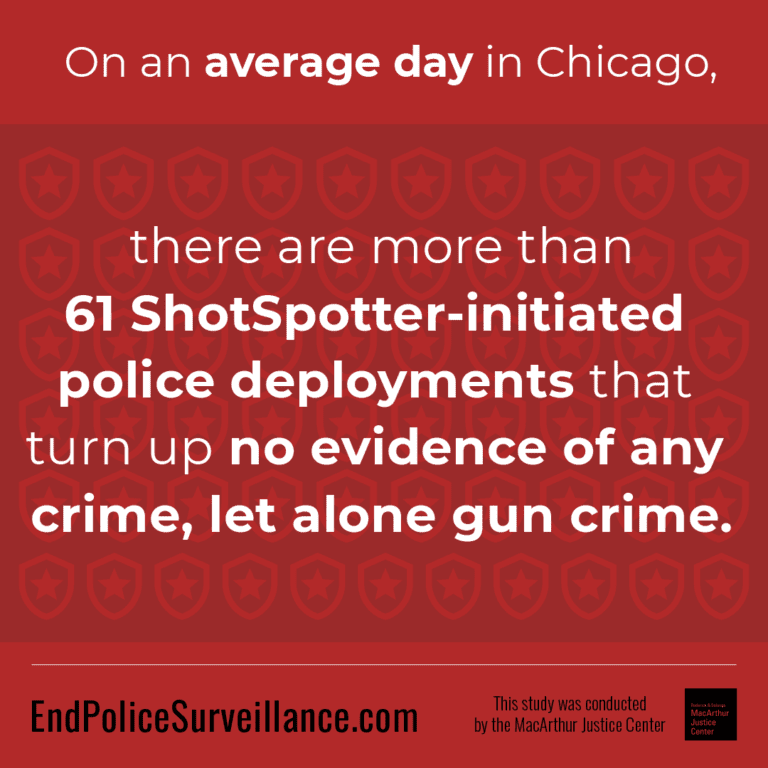
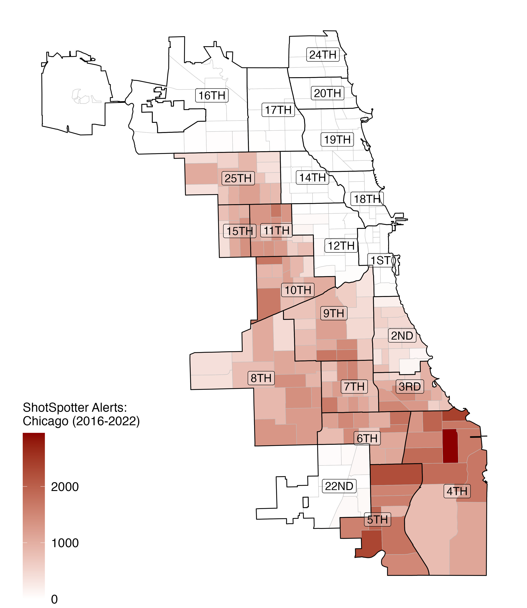

<style type="text/css">
.remark-slide-content {
    font-size: 25px;
    padding: 1em 4em 1em 4em;
}
</style>
```{r setup, include=FALSE}
library(kableExtra)
library(xaringanExtra)
options(htmltools.dir.version = FALSE)
knitr::opts_chunk$set(echo = F,  message = F, warning = F,
                      fig.asp = 9/16,
  fig.align = 'center',
  echo = F,
  out.width = "100%",
  dpi= 300)
# knitr::opts_knit$set(root.dir = rprojroot::find_rstudio_root_file())
```
```{js}
$( document ).ready(function() {
  $(".lightable-classic").removeClass("table").css("display", "table");
});
```


```{css, echo = F}
/* This changes any table of class regression to 20 size font */
.regression table {
  font-size: 20px;     
}
/* This removes the odd-even shade on tables */
.remark-slide thead, .remark-slide tr:nth-child(2n) {
        background-color: white;
    }
```

```{r xaringan-panelset, echo=FALSE}

## this code enables the use of panels inside of the presentation
xaringanExtra::use_panelset()
xaringanExtra::style_panelset_tabs(active_foreground = "blue", background = "white", font_family = "Roboto", 
                                   inactive_opacity = 0.5)

```

# Motivation:

.pull-left[
## State of Crime in the US:
  - Gun violence
    - 2021: Most gun fatalies ever (Pew Research Center)
    - 2022: 647 mass shootings (Gun Violence Archive)
  - More mistrust of the police]

--

.pull-right[
## Solution?
  - ShotSpotter Technology
    - Gunshot dectection
    - "Colorblind"
  - Widespread (150+ cities)
    - Our setting: Chicago
  - Costly: $9 million a year
]

--

### <font color="blue">**Research Question**</font>: 
### How does investment in ShotSpotter affect the time allocation of scarce police resources ?

- Priority 1: 911 Call-to-dispatch / Call-to-on-scene
  
---
# Why do we care about response times?

.font130[
> “If police can arrive within one minute of the commission of an offense, they are more likely to catch the suspect. Any later and the chances of capture are very small, probably less than one in ten.”- (Baley 1996)
]

--

### Support for Reponse Times:
.font110[
- Lower response times results in:
    - Less likelihood of an injury (DeAngelo et. al. 2023)
    - Higher crime clearance (Blanes i Vidal and Kirchmaier 2018)
- Rapid response  most important (College of Policing 2013)
- Enhance community trust
]
---
# Why would ShotSpotter affect response times?


.pull-left[

### Police Forces:
  - A fixed amount of daily resources
  
### ShotSpotter Resource-Intensive:
  - Respond to every alert (Priority 1)
  - ~60 dispatches a day
  - ~20 minutes inspecting the scene

### Time Wasted?
 - Does this time investment come at the expense of other important 911 calls?
]

.pull-right[
```{r}

```
]
---
# Summary of Paper:

--
.pull-left[
## Setting: 
  - Chicago: 2016-2022
    - Second largest police force
    - Third largest city

## Data:
 - All 911 dispatches from Chicago
 - Merge with:
  - Police shifts
  - Crime/arrest data
  - ShotSpotter alerts
]

--
.pull-right[
## Empirical Strategy:
  - Staggered difference-in-difference
    - Variation: ShotSpotter rollouts across police districts
    - Remove ShotSpotter dispatches
  

## Main Results:
  - For other reported crimes:
    - +2.5 minutes in call-to-dispatch
    - +3 minutes in call-to-on-scene
  - Lower arrest rates + lower gun victimization
]
---
# Contribution:
### First economics study to provide causal analysis on ShotSpotter

--
### Related Literature:

.panelset.sideways[
.panel[.panel-name[ShotSpotter Specific]
<font color="blue"> We find unintended (increased response times/lower arrest rates) and intended (lower gun violence) outcomes. </font>
- Economics:
  - Use ShotSpotter as data for alternative crime/mistrust measure (Carr and Doleac 2018, Ang et. al 2021)
- Non-Econonomics: 
  - Mixed response time results (Mazerolle et al. 1998, Mares and Blackburn 2021)
]
.panel[.panel-name[Police Technology]
<font color="blue"> We find detrimental consequences of an expensive, resource-intensive, technology. </font>
- Benefits of Police Technology:
    - Body Worn Cameras $\rightarrow$ lower use of force/complaints (Zamoff et al.2021, Braga et al.2022, Ferrazares 2023)
    - Predictable Policing $\rightarrow$ less crime (Mastourbi 2020)
    - Tactical Equipment $\rightarrow$ less crime (Bove and Gavrilova 2017, Harris et al. 2017))
]

.panel[.panel-name[Rapid Response]
<font color="blue"> We identify a determinant of higher response times, and can quantify at a micro-level. </font>
- Effects of Response Times:
  - Less likelihood of an injury (DeAngelo et. al. 2023)
  - Higher crime clearance (Blanes i Vidal and Kirchmaier 2018)
]

.panel[.panel-name[Gun Control]
<font color="blue"> We find evidence of lower gun victimization, linked directly to a police operating procedure. </font>
- Alternative Studies:
  - Gun-access policies (Colmer and Doleac 2022)
  - Direct, personal intervention (Bhatt et al. 2023)

]
]


---
# What is ShotSpotter and how does it work?

```{r, out.width = "850px", out.height = "550px", fig.align="center"}
knitr::include_graphics("libs/figures/shotspot_works.png")
```

---
# ShotSpotter in Chicago:
.pull-left[
### Staggered Rollout
 - 12 of 22 police districts in 2017-2018
 
### High Priority
  - Priority 1 (immediate dispatch)
      - Active shooter, domestic disturbance
      - ~5% of all Priority 1 dispatches
  - Priority 2 (rapid dispatch) 
      - Suspicious person, car accident
  - Priority 3 (routine dispatch)
      - Noise disturbance, parking violation
]

.pull-right[
```{r, out.width = "650px", out.height = "520px"}

```

]
---
# ShotSpotter Alert Trends/Averages:
```{r, eval = T}
source("libs/figures/shotspotter_alert_trends.R")
```
```{r, eval = T}
shotspotter_trend
```

---
# Estimation Strategy:
### Specification (OLS):

$$Y_{d,t} = \beta ShotSpotter_{d,t}  + \gamma_{d} + \delta_t + \lambda \mathbb{X}_{d,t} + \epsilon_{d,t}$$ 
--

* **Remove all ShotSpotter dispatches**
* $Y_{d,t}$ is an outcome of average <b>daily</b> time (in seconds) in police district $d$ in time $t$ 
  - 911 Call-to-Dispatch/911 Call-to-On-Scene
* $ShotSpotter_{d,t}$ is the binary treatment 
* $\gamma_d$ is a police district-specific fixed effect
* $\delta_t$ is a day-by-month-by-year fixed effect
* $\mathbb{X}_{d,t}$ is a vector of controls:
    - Officer hours, number of 911 calls (by priority)
* Standard errors clustered by police district

---
class: regression

# Main Results:

```{r}
source("libs/tables/regressions_dispatches_1.R")
source("libs/tables/regressions_arrest_rate.R")
source("libs/tables/regressions_victimization.R")
```

.panelset[
.panel[.panel-name[Call-to-Dispatch]
```{r}
dispatch_table_1
```
]


.panel[.panel-name[Call-to-On-Scene]
```{r}
dispatch_table_2
```
]

.panel[.panel-name[Arrest Rate]
```{r}
arrest_rate_table
```
]
.panel[.panel-name[Gun Victimization]
```{r}
victimization
```
]
]


---
# Dynamic Effects: Call to Dispatch (Priority 1)

```{r, eval = T}
source("libs/figures/event_study_dispatches.R")
```

```{r, eval = T}
entry_1_es
```

---
# Dynamic Effects: Call to On-Scene (Priority 1)
```{r, eval = T}
eos_1_es
```

---
# Call to Dispatch Times (seconds): Top 5

```{r}
source("libs/figures/forestplot_by_priority.R")
# source("libs/figures/forestplot_by_priority_onscene.R")
```

```{r, eval = T}
forestplot_priority_call_dispatch
```

---
# Other Analysis:

--
.pull-left[
## Robustness:
- TWFE Robust Estimators
- Sample Selection:
  - Remove 2020 (Covid)
  - Remove never-treated
- Leave-one-out
  
## Intensive Margin:
- Alternative Variation: Alerts
  - (RHS): Gunshot alert $\rightarrow$ random event
  - 1 additional alert = +18 seconds to dispatch
  ]
  
--
.pull-right[
## Heterogeneity:
- Break-downs by:
  - Officer Hours
  - Weekdays/Weekends
  - Night/day (in progress)
  ]
  
---
# Conclusion:

### Main Takeaways:

- First causal policy analysis of ShotSpotter:
    - Unintended Consequences:
      - Higher priority 1 response times (omitting ShotSpotter dispatches)
          - Call-to-Dispatch (+2.5 minutes/ 45% increase)
      - Lower arrest rates for priority 1 (5% decrease)
    - Intended Consequence 
      - Lower gun victimization (suggestive evidence)
- For further research: 
    - Cost-benefit analysis
    - Other suggestions?
  


