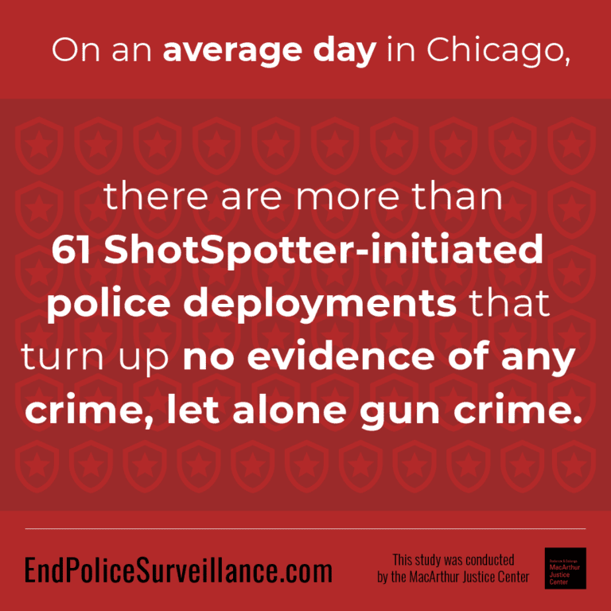
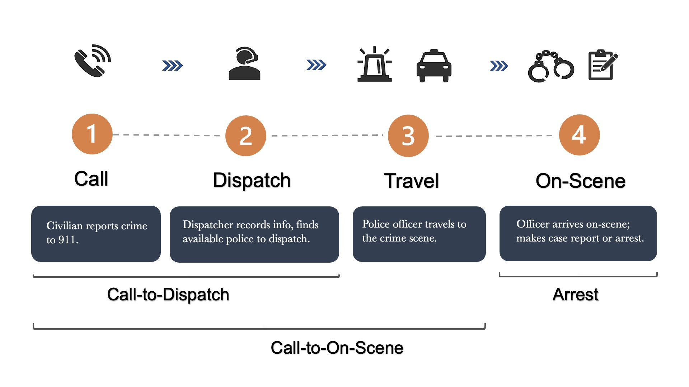
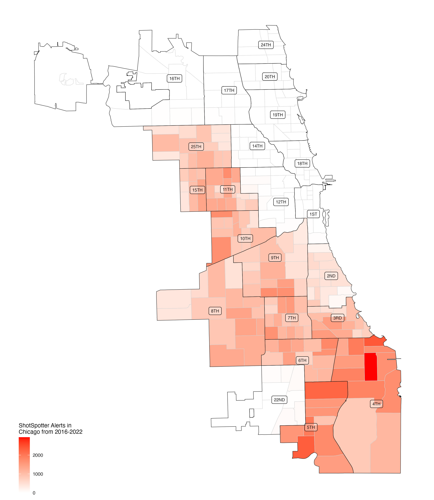

<style type="text/css">
.remark-slide-content {
    font-size: 25px;
    padding: 1em 4em 1em 4em;
}
</style>
```{r setup, include=FALSE}
library(kableExtra)
library(xaringanExtra)
options(htmltools.dir.version = FALSE)
knitr::opts_chunk$set(echo = F,  message = F, warning = F,
                      fig.asp = 9/16,
  fig.align = 'center',
  echo = F,
  out.width = "100%",
  dpi= 300)
# knitr::opts_knit$set(root.dir = rprojroot::find_rstudio_root_file())
```
```{js}
$( document ).ready(function() {
  $(".lightable-classic").removeClass("table").css("display", "table");
});
```


```{css, echo = F}
/* This changes any table of class regression to 20 size font */
.regression table {
  font-size: 20px; 
  width: 100%;
  background-color: transparent;
  border: none;
  border-spacing: unset;
}

table > :is(thead, tbody) > tr > :is(th, td) {
  padding: 3px;
  text-align: left;
  background-color: transparent;
}
table > thead > tr > :is(th, td) {
  border-top: 2px solid;
  border-bottom: 1px solid;
  background-color: transparent;
}
table > tbody > tr:last-child > :is(th, td) {
  border-bottom: 2px solid;
  background-color: transparent;
}
/* This removes the odd-even shade on tables */
.remark-slide thead, .remark-slide tr:nth-child(2n) {
        background-color: white;
    }
```


```{r xaringan-panelset, echo=FALSE}

## this code enables the use of panels inside of the presentation
xaringanExtra::use_panelset()
xaringanExtra::style_panelset_tabs(active_foreground = "blue", background = "white", font_family = "Roboto", 
                                   inactive_opacity = 0.5)

```


# Motivation:

.pull-left[
### Rise of AI Technology:
  - Artificial Intelligence (AI) -> police forces
  - License plate readers, observation cameras, predictive policing
  - AI changes officer production function]

--

.pull-right[
### ShotSpotter Technology
  - Gunshot detection
  - 12% of gunfire reported (Carr and Doleac, 2017)
  - Widespread (150+ cities world-wide)
  - Costly: $11 million a year
]

--

### <font color="blue">**Research Question**</font>: 
### How does investment in ShotSpotter affect the time allocation of scarce police resources ?

- Priority 1 911 Dispatches: Call-to-Dispatch / Call-to-On-Scene

---
# What is ShotSpotter and how does it work?

```{r, out.width = "850px", out.height = "550px", fig.align="center"}
knitr::include_graphics("libs/figures/shotspot_works.png")
```

---
# Why do we care about response times?

.font120[
> “If police can arrive within one minute of the commission of an offense, they are more likely to catch the suspect. Any later and the chances of capture are very small, probably less than one in ten.”- (Baley 1996)
]

--

### Support for Reponse Times:
.font110[
- Lower response times results in:
    - Less likelihood of an injury (DeAngelo et al. 2023)
    - Higher crime clearance (Blanes i Vidal and Kirchmaier 2018)
- Rapid response most important (College of Policing 2013)
- Health implications
    - Longer travel -> worse patient outcomes (Wilde, 2013, Avdic, 2016)
]
---
# Why would ShotSpotter affect response times?

.pull-left[
```{r}

```
]

--
.pull-right[

### Police Forces:
  - A fixed amount of daily resources
  
### ShotSpotter Resource-Intensive:
  - Classified as Priority 1 
  - Respond to every *hypothesized* alert 
  - ~60 daily dispatches
  - ~20 min investigating

### Time Wasted?
 - Costly for other *confirmed* 911 calls from civilians?


]


---
# Summary of Paper:

--
.pull-left[
## Setting: 
  - Chicago: 2016-2022
    - Second largest police force
    - Third largest city

## Data:
 - All 911 call dispatches from Chicago
 - Merge with:
  - Police shifts
  - Arrests
  - Victimizations
]

--
.pull-right[
## Empirical Strategy:
  - Staggered difference-in-differences
    - Variation: ShotSpotter rollouts across police districts
  

## Main Results:
  - For Priority 1 911 calls:
    - +1 minute Call-to-Dispatch (23%)
    - ~+2 minutes Call-to-On-Scene (13%)
  - Lower arrest probability (8%)
]
---
# Contribution:
### In-depth, causal analysis on a wide-spread police technology, whose consequences are relatively unknown.

--
### Related Literature:

.panelset.sideways[
.panel[.panel-name[ShotSpotter Specific]
<font color="blue"> We find unintended consequences due to large resource investment (increased response times/lower arrest rates). </font>
- Economics:
  - Use ShotSpotter as data for alternative crime/mistrust measure (Carr and Doleac 2018; Ang et. al 2021)
- Non-Econonomics: 
  - Better accuracy, little crime impact or case resolution (Piza et al., 2023; Mares and Blackburn, 2012; Choi et al., 2014)
]
.panel[.panel-name[Police Technology]
<font color="blue"> We find detrimental consequences of an expensive, resource-intensive, technology. </font>
- Benefits of Police Technology:
    - Body Worn Cameras $\rightarrow$ lower use of force/complaints (Zamoff et al. 2021; Braga et al. 2022; Ferrazares 2023)
    - Predictive Policing $\rightarrow$ less crime (Mastrobuoni, 2020; Jabri, 2021; Heller et al., 2022)
    - Tactical Equipment $\rightarrow$ less crime (Bove and Gavrilova 2017; Harris et al. 2017))
]

.panel[.panel-name[Rapid Response]
<font color="blue"> We identify a determinant of higher response times, and can quantify at a micro-level. </font>
- Effects of Response Times:
  - Higher crime clearance (Blanes i Vidal and Kirchmaier, 2018)
  - Less likelihood of an injury (DeAngelo et al., 2023)
]


.panel[.panel-name[Emergency Medical Services]
<font color="blue"> We find substantial delays in emergency medical service calls $\rightarrow$ delay victim treatment. </font>
- Effects on delayed medical treatment in the field:
  - Longer ambulance resposne $\rightarrow$ lower mortality (Wilde, 2013)
  - Longer travel times $\rightarrow$ lower mortality (Avdic, 2016)
]

]

---
class: inverse, mline, center, middle

# Institutional Background and Setting

---
# The Pipeline of 911 Calls:

```{r, out.width = "850px", out.height = "550px", fig.align="center"}

```

---
# ShotSpotter in Chicago:
.pull-left[
### Staggered Rollout
 - 12 of 22 police districts in 2017-2018

### Resource Intensive
  - Priority 1 (immediate dispatch)
      - Active shooter, domestic disturbance
      - ~5% of all Priority 1 dispatches
  - Same operating procedure as 911
      - No specialized response team
]

.pull-right[
```{r, out.width = "650px", out.height = "520px"}

```

]
---
# ShotSpotter Alert Trends/Averages:
```{r, eval = T}
source("libs/figures/shotspotter_alert_trends.R")
```
```{r, eval = T}
shotspotter_trend
```
---
class: inverse, mline, center, middle

# Data and Empirical Strategy

---
class: regression
# Data and Sample Restrictions:

.pull-left[
### Data Overview:
- Freedom of Information Act
- Priority 1 911 Dispatches (2016-2022)
- No ShotSpotter dispatches
]

.pull-right[
### Exclusions:
- Outliers (0.04%; 1.6%)
- January 1/July 4/December 31 (1%)
- Negative response times (.03%)
]

--

```{r, results='asis', echo=FALSE}
xfun::file_string('tables/summary_stats.html')
## put in Summary stats table
```


---
# Estimation Strategy:
### Specification (OLS):

$$\text{ResponseTime}_{cdt} = \beta \text{ShotSpotter}_{dt}  + \eta_{\bar{c}} + \delta_{d} + \gamma\mathbb{X}_{f(t)} +  \varepsilon_{cdt}$$
--

* $\text{ResponseTime}_{cdt}$ is call $c$ in police district $d$ in time $t$.
  - Priority 1 911 Call-to-Dispatch/911 Call-to-On-Scene
* $\text{ShotSpotter}_{dt}$ is the binary treatment
* $\eta_{\bar{c}}$ is a call-type fixed effect
* $\delta_{d}$ is a police district-specific fixed effect
* $\mathbb{X}_{f(t)}$ is a vector of time-varying controls:
    - Hour-of-day and day-by-month-by-year
* Standard errors clustered by police district
*  Intuition: <font color="blue"> average change in response times on days when ShotSpotter is implemented accounting for expected differences in districts/time/call-types. </font>

---
class: regression

# Main Results:

.panelset.sideways[
.panel[.panel-name[Call-to-Dispatch]
```{r,results='asis', echo=FALSE}
xfun::file_string('tables/dispatch_table.html')
```
]


.panel[.panel-name[Call-to-On-Scene]
```{r,results='asis', echo=FALSE}
xfun::file_string('tables/onscene_table.html')
```
]

.panel[.panel-name[Arrest Rate]
```{r,results='asis', echo=FALSE}
xfun::file_string('tables/arrest_table.html')
```
]

]

---
# Mechanisms:

---
class: regression
# Mechanism (Extensive Margin):
```{r,results='asis', echo=FALSE}
xfun::file_string('tables/mechanism_extensive.html')
```

---
class: regression
# Mechanisms (Intensive Margin)
```{r,results='asis', echo=FALSE}
xfun::file_string('tables/mechanism_intensive.html')
```

---
# Do Shifts with more ShotSpotter dispatches
```{r, out.width = "1000px", out.height = "550px", fig.align="center"}
knitr::include_graphics("figures/watch_graph.jpeg")
```

---
# Assumptions:

--

### 1. Response times similar trend without ShotSpotter
  * Event studies 
  * Rambachan and Roth (2023) sensitivity analysis

--

### 2. No change in dispatching procedures/call-types post-implementation
  * Standard Operating Procedures do not change
  * Specific call-type analysis

--

### 3. No other policies that coincide that may affect response times
  * Strategic Decision Support Centers (SDSC)
  * Body-Worn Cameras (BWC)


---
# Common Trends: Call-to-Dispatch

```{r, out.width = "850px", out.height = "550px", fig.align="center"}
knitr::include_graphics("figures/entry_1_es.jpeg")
```

---
# Common Trends: Call-to-On-Scene

```{r, out.width = "850px", out.height = "550px", fig.align="center"}
knitr::include_graphics("figures/eos_1_es.jpeg")
```
---
# Relaxing Common Trends

---
# Trickle Down Effect: 


.panelset.sideways[
.panel[.panel-name[Priority 1 (Immediate)]
```{r, out.width = "850px", out.height = "550px", fig.align="center"}
knitr::include_graphics("figures/priority_1_graph.jpeg")
```
]


.panel[.panel-name[Priority 2 (Rapid)]
```{r, out.width = "850px", out.height = "550px", fig.align="center"}
knitr::include_graphics("figures/priority_2_graph.jpeg")
```
]

.panel[.panel-name[Priority 3 (Routine)]
```{r, out.width = "850px", out.height = "550px", fig.align="center"}
knitr::include_graphics("figures/priority_3_graph.jpeg")
```
]

]


