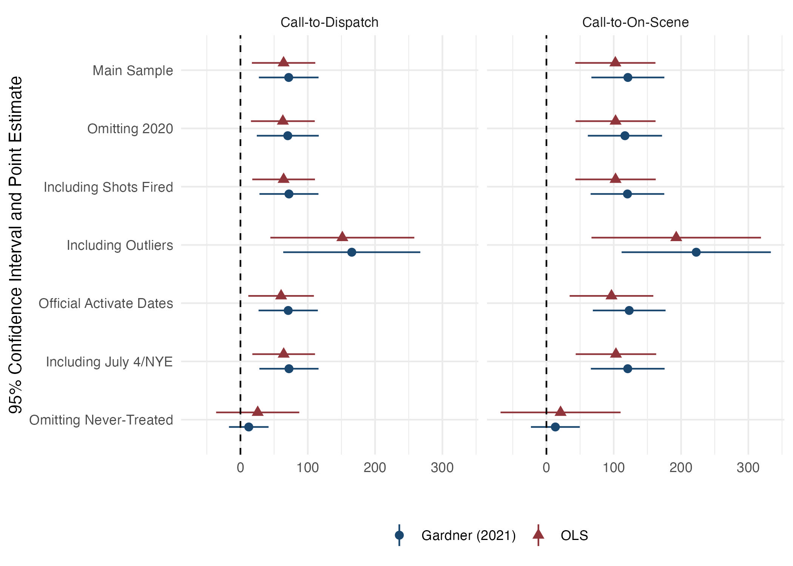
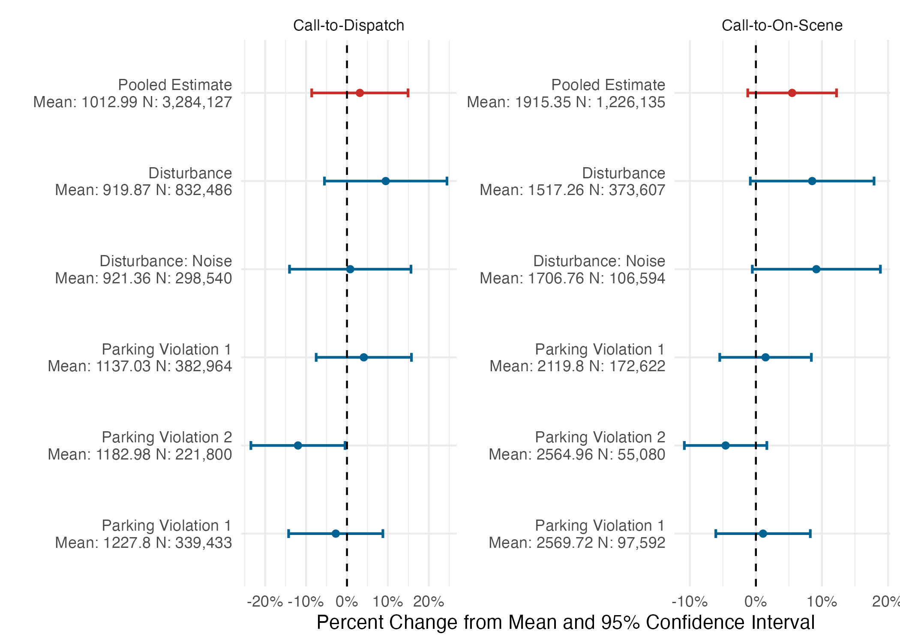

<style type="text/css">
.remark-slide-content {
    font-size: 25px;
    padding: 1em 4em 1em 4em;
}
</style>
```{r setup, include=FALSE}
library(kableExtra)
library(xaringanExtra)
options(htmltools.dir.version = FALSE)
knitr::opts_chunk$set(echo = F,  message = F, warning = F,
                      fig.asp = 9/16,
  fig.align = 'center',
  echo = F,
  out.width = "100%",
  dpi= 300)
# knitr::opts_knit$set(root.dir = rprojroot::find_rstudio_root_file())
```
```{js}
$( document ).ready(function() {
  $(".lightable-classic").removeClass("table").css("display", "table");
});
```


```{css, echo = F}
/* This changes any table of class regression to 20 size font */
.regression table {
  font-size: 20px; 
  width: 100%;
  background-color: transparent;
  border: none;
  border-spacing: unset;
}

table > :is(thead, tbody) > tr > :is(th, td) {
  padding: 3px;
  text-align: left;
  background-color: transparent;
}
table > thead > tr > :is(th, td) {
  border-top: 2px solid;
  border-bottom: 1px solid;
  background-color: transparent;
}
table > tbody > tr:last-child > :is(th, td) {
  border-bottom: 2px solid;
  background-color: transparent;
}
/* This removes the odd-even shade on tables */
.remark-slide thead, .remark-slide tr:nth-child(2n) {
        background-color: white;
    }
```


```{r xaringan-panelset, echo=FALSE}

## this code enables the use of panels inside of the presentation
xaringanExtra::use_panelset()
xaringanExtra::style_panelset_tabs(active_foreground = "blue", background = "white", font_family = "Roboto", 
                                   inactive_opacity = 0.5)

```


# Motivation:

.pull-left[
### Rise of AI Technology:
  - Artificial Intelligence (AI) $\rightarrow$ police forces
  - License plate readers, facial recognition, predictive policing
  - AI changes officer production function]

--

.pull-right[
### ShotSpotter Technology
  - Gunshot detection
  - 12% of gunfire reported (Carr and Doleac, 2017)
  - Widespread (150+ cities world-wide)
  - In Chicago: $11 million a year
]

--

### <font color="blue">**Research Question**</font>: 
### How does investment in ShotSpotter affect the time allocation of scarce police resources ?

- Priority 1: 911 Call-to-Dispatch / 911 Call-to-On-Scene

---
# What is ShotSpotter and how does it work?

```{r, out.width = "850px", out.height = "550px", fig.align="center"}
knitr::include_graphics("libs/figures/shotspot_works.png")
```

---
# Why do we care about response times?

.font120[
> “If police can arrive within one minute of the commission of an offense, they are more likely to catch the suspect. Any later and the chances of capture are very small, probably less than one in ten.”- (Baley 1996)
]

--

### Support for Reponse Times:
.font110[
- Lower response times results in:
    - Higher crime clearance (Blanes i Vidal and Kirchmaier 2018)
    - Less likelihood of an injury (DeAngelo et al. 2023)
- Rapid response most important (College of Policing 2013)
- Health implications
    - Longer travel $\rightarrow$ worse patient outcomes (Wilde, 2013, Avdic, 2016)
]
---
# Why would ShotSpotter affect response times?

.pull-left[

### Police Forces:
  - A fixed amount of daily resources
  
### ShotSpotter Resource-Intensive:
  - Classified as Priority 1 (highest)
  - Respond to every *hypothesized* gunfire 
  - ~60 daily dispatches
  - ~20 min investigating the scene

### Time Wasted?
 - Costly for other *confirmed* 911 calls from civilians?


]

--
.pull-right[
```{r}
knitr::include_graphics("libs/figures/ShotSpotter__graphic.png")
```
]


---
# Summary of the Paper:

--
.pull-left[
## Setting: 
  - Chicago: 2016-2022
    - Second largest police force
    - Third largest city

## Data:
 - All dispatched Priority 1 911 calls for police service
  - Police shifts
  - Arrests
  - Victimizations
]

--
.pull-right[
## Empirical Strategy:
  - Staggered difference-in-differences
    - Variation: ShotSpotter rollouts across police districts
  

## Main Results:
  - For Priority 1 911 calls:
    - +1 minute Call-to-Dispatch (23%)
    - +2 minutes Call-to-On-Scene (13%)
    - Lower arrest probability (8%)
]
---
# Contribution:
### In-depth, causal analysis on a wide-spread police technology, whose consequences are relatively unknown.

--
### Related Literature

.panelset.sideways[
.panel[.panel-name[ShotSpotter Specific]
<font color="blue"> We find unintended consequences due to large resource investment (increased response times/lower arrest rates). </font>
- Economics:
  - Use ShotSpotter as data for alternative crime/mistrust measure (Carr and Doleac 2018; Ang et. al 2021)
- Non-Econonomics: 
  - Better accuracy, little crime impact or case resolution (Piza et al., 2023; Mares and Blackburn, 2012; Choi et al., 2014)
]
.panel[.panel-name[Police Technology]
<font color="blue"> We find detrimental consequences of an expensive, resource-intensive, technology. </font>
- Benefits of Police Technology:
    - Body Worn Cameras $\rightarrow$ lower use of force/complaints (Zamoff et al. 2021; Braga et al. 2022; Ferrazares 2023)
    - Predictive Policing $\rightarrow$ less crime (Mastrobuoni, 2020; Jabri, 2021; Heller et al., 2022)
    - Tactical Equipment $\rightarrow$ less crime (Bove and Gavrilova 2017; Harris et al. 2017))
]

.panel[.panel-name[Rapid Response]
<font color="blue"> We identify a determinant of higher response times, and can quantify at a micro-level. </font>
- Effects of Response Times:
  - Higher crime clearance (Blanes i Vidal and Kirchmaier, 2018)
  - Less likelihood of an injury (DeAngelo et al., 2023)
]

]

---
class: inverse, mline, center, middle

# Institutional Background and Setting

---
# Important Officer Responsibilities:

.pull-left[
### 1. Patrol Assigned District
  - .font80[Respond to incidents that are observed]
  - .font80[District is ~100k people]
  - .font80[Officers are assigned beats within districts]

### 2. Respond to 911 calls
  - .font80[Only assigned to calls within district]
  - .font80[Also arrive to emergency medical crime scenes]
  - .font80[Can result in arrest or case report]
]

.pull-right[
### 3. Paperwork
  - .font80[Document all their activity]
  - .font80[Use-of-force, street stops, arrests, case reports all require substantial documentation.]

### 4. Appear in Court
  - .font80[Presents testimony]
]
---
# 911 Dispatch Procedure:

.panelset.sideways[

.panel[.panel-name[Pipeline:]
## 911 Dispatch Pipeline:

1. Emergency call is made
  - .font80[Civilian reports crime to 911.]
2. Dispatcher dispatches police</mark>
  - .font80[Dispatcher records info, finds available police to dispatch.] 
3. Police travel to crime scene
  - .font80[Police officer travels to the crime scene.]
4. Police arrive on-scene
  - .font80[Officer arrives on-scene; makes case report or arrest if necessary.]
]
.panel[.panel-name[Call-to-Dispatch]
## 911 Dispatch Pipeline:

1. <mark>Emergency call is made</mark>
  - .font80[<mark>Civilian reports crime to 911.</mark>]
2. <mark>Dispatcher dispatches police</mark>
  - .font80[<mark>Dispatcher records info, finds available police to dispatch.</mark>] 
3. Police travel to crime scene
  - .font80[Police officer travels to the crime scene.]
4. Police arrive on-scene
  - .font80[Officer arrives on-scene; makes case report or arrest if necessary.]
]

.panel[.panel-name[Call-to-On-Scene]
## 911 Dispatch Pipeline:

1. <mark>Emergency call is made</mark>
  - .font80[<mark>Civilian reports crime to 911.</mark>]
2. <mark>Dispatcher dispatches police</mark>
  - .font80[<mark>Dispatcher records info, finds available police to dispatch.</mark>] 
3. <mark>Police travel to crime scene</mark>
  - .font80[<mark>Police officer travels to the crime scene.</mark>]
4. Police arrive on-scene
  - .font80[Officer arrives on-scene; makes case report or arrest if necessary.]
]

.panel[.panel-name[Arrest]
## 911 Dispatch Pipeline:

1. Emergency call is made
  - .font80[Civilian reports crime to 911.]
2. Dispatcher dispatches police
  - .font80[Dispatcher records info, finds available police to dispatch.] 
3. Police travel to crime scene
  - .font80[Police officer travels to the crime scene.]
4. <mark>Police arrive on-scene</mark>
  - .font80[<mark>Officer arrives on-scene; makes case report or arrest if necessary.</mark>]
]


]

---
# 911 Call Priorities in Chicago:

.pull-left[

### Priority 1 (immediate dispatch):
  - .font60[Imminent threat to life, bodily injury, or major property damage/loss]

### Priority 2 (rapid dispatch):
  - .font60[Timely police action has the potential to affect the outcome of an incident]
  
### Priority 3 (routine dispatch):
  - .font60[Does not involve an imminent threat...a reasonable delay in police action will not affect the outcome of the incident]
]

.pull-right[

```{r, out.width = "600px", out.height = "500px"}
knitr::include_graphics("figures/priority_fractions.jpeg")
```
]
---
# ShotSpotter in Chicago:
.pull-left[
### Staggered Rollout
 - .font80[12 of 22 police districts in 2017-2018]
 - .font80[Implemented with full coverage across districts]
 - .font80[Rational: respond to high gun-crime]

### Resource Intensive
  - .font80[Priority 1]
  - .font80[Same officers responding as 911 call]
  - .font80[Additional: canvass 25 meter radius, add information]
  - .font80[~60 daily dispatches, 20 min avg.]
]

.pull-right[
```{r, out.width = "400px", out.height = "500px"}

```

]
---
# ShotSpotter Dispatch Trends/Averages:

```{r, out.width = "900px", out.height = "550px", fig.align="center"}
knitr::include_graphics("figures/shotspotter_trend.jpeg")
```
---
class: inverse, mline, center, middle

# Data and Empirical Strategy

---
class: regression
# Data and Sample Restrictions:

.pull-left[
### Data Overview:
- Freedom of Information Act
- Priority 1 911 Call-Related Dispatches (2016-2022)
- No ShotSpotter dispatches
]

.pull-right[
### Exclusions:
- Exclude lower priority calls
- Outliers (0.04%; 1.6%), Negative response times (.03%)
- January 1/July 4/December 31
]

--

```{r, results='asis', echo=FALSE}
xfun::file_string('tables/summary_stats.html')
## put in Summary stats table
```


---
class: regression
# Estimation Strategy:
### Specification (OLS):

$$\text{ResponseTime}_{cdt} = \beta \text{ShotSpotter}_{dt}  + \eta_{\bar{c}} + \delta_{d} + \gamma\mathbb{X}_{f(t)} +  \varepsilon_{cdt}$$
--

* $\text{ResponseTime}_{cdt}$ is call $c$ in police district $d$ in time $t$.
  - Priority 1 911 Call-to-Dispatch/911 Call-to-On-Scene
* $\text{ShotSpotter}_{dt}$ is the binary treatment
* $\eta_{\bar{c}}$ is a call-type fixed effect
* $\delta_{d}$ is a police district-specific fixed effect
* $\mathbb{X}_{f(t)}$ is a vector of time-varying controls:
    - Hour-of-day and day-by-month-by-year
* Standard errors clustered by police district
* <font color="blue"> Intuitively, this is the average change in response times on days with ShotSpotter accounting for expected differences in districts/time/call-types. </font>


---
# Potential Threats to Identification:

--

#### 1. Violation of Common Trends:
  * .font80[Event studies] 
  * .font80[Rambachan and Roth (2023) sensitivity analysis]

--

#### 2. Change in dispatching procedures/call-types post-implementation:
  * .font80[Standard operating procedures same for Priority 1 911 calls]
  * .font80[Specific call-type analysis]

--

#### 3. Other policies that coincide that may affect response times:
  * .font80[Strategic Decision Support Centers (SDSC) and Body-Worn Cameras (BWC)]

--

#### 4. OLS with staggered rollouts:
  * .font80[Two-stage difference-in-differences (Gardner 2022)]

---
class: inverse, mline, center, middle

# Results

---
# Raw Data Preview:
```{r, out.width = "850px", out.height = "550px", fig.align="center"}
knitr::include_graphics("figures/raw_evidence_figure.jpeg")
```

---
class: regression

# Main Results:

.panelset[
.panel[.panel-name[Call-to-Dispatch]
```{r,results='asis', echo=FALSE}
xfun::file_string('tables/dispatch_table.html')
```
]


.panel[.panel-name[Call-to-On-Scene]
```{r,results='asis', echo=FALSE}
xfun::file_string('tables/onscene_table.html')
```
]

.panel[.panel-name[Arrest Rate]
```{r,results='asis', echo=FALSE}
xfun::file_string('tables/arrest_table.html')
```
]

]

---
# Dynamic Effects: Call-to-Dispatch

```{r, out.width = "850px", out.height = "550px", fig.align="center"}
knitr::include_graphics("figures/entry_1_es.jpeg")
```

---
# Dynamic Effects: Call-to-On-Scene

```{r, out.width = "850px", out.height = "550px", fig.align="center"}
knitr::include_graphics("figures/eos_1_es.jpeg")
```
---
# Robustness:

## Main Results:
- Leave-one-out analysis
- Sample restrictions:
  - Omit 2020 (Covid-19)
  - Reintroduce outliers
  - Reintroduce omitted days
  
## Event Studies:
- Rambachan and Roth (2023) sensitivity 
- Robust to varying linear trends


---
# Robustness Sample Restrictions:
```{r, out.width = "850px", out.height = "550px", fig.align="center"}

```

---
class: inverse, mline, center, middle

# Mechanism


---
# Potential Mechanism:

<font color="blue"><b>ShotSpotter overflows an officer's production function and incapacitates them from attending to other tasks.</b></font>

#### 1. Estimate most resource-constrained times (extensive margin)
  - Split by police-district median number of officer hours
  - Separate by shift-type
    
#### 2. Use ShotSpotter dispatches as intensity measure (intensive margin)

$$\text{ResponseTime}_{cdt} = \beta \text{NumberSSTDispatches}_{dt}  + \eta_{\bar{c}} + \delta_{d} + \gamma\mathbb{X}_{f(t)} +  \varepsilon_{cdt}$$

  - $\text{NumberSSTDispatches}_{dt}$ is number of ShotSpotter dispatches in a police-district
  - Restrict to only treated periods


---
class: regression
# Mechanism: Less Officers
```{r,results='asis', echo=FALSE}
xfun::file_string('tables/mechanism_extensive.html')
```

---
# Mechanism: Shift Times
```{r, out.width = "1000px", out.height = "550px", fig.align="center"}
knitr::include_graphics("figures/watch_graph.jpeg")
```

---
class: regression
# Mechanism: Intensive Margin
```{r,results='asis', echo=FALSE}
xfun::file_string('tables/mechanism_intensive.html')
```


---
class: inverse, mline, center, middle

# Heterogeneity by Priority

---
# Trickle Down Effect: 


.panelset.sideways[
.panel[.panel-name[Priority 1 (Immediate)]
```{r, out.width = "850px", out.height = "550px", fig.align="center"}
knitr::include_graphics("figures/priority_1_graph.jpeg")
```
]


.panel[.panel-name[Priority 2 (Rapid)]
```{r, out.width = "850px", out.height = "550px", fig.align="center"}
knitr::include_graphics("figures/priority_2_graph.jpeg")
```
]

.panel[.panel-name[Priority 3 (Routine)]
```{r, out.width = "850px", out.height = "550px", fig.align="center"}

```
]

]
---
class: inverse, mline, center, middle

# Why Implement ShotSpotter?

---
# Possible Benefits?

## Does ShotSpotter provide benefits?

* Analyze the probability of a victim injury
    - Following DeAngelo et al. (2023)

## New Restrictions:

* Restrict data to only *unrealized* events $\rightarrow$ police intervention may affect outcome
* Examples: 
  * Include: 'Call for Help' $\rightarrow$ unrealized
  * Exclude: 'Person Shot' $\rightarrow$ realized
* Main Result: Suggestive (not conclusive!) evidence of lower injury for gun-related calls

---
# Effect on Victim Injury:
```{r,results='asis', echo=FALSE}
xfun::file_string('tables/victim_table.html')
```
---
# Conclusion:

### Main Takeaways:

- An in-depth analysis on consequences of ShotSpotter:
    - Unintended Consequences:
      - Higher response times 
          - Call-to-Dispatch (+1 minute/ 23% increase)
          - Call-to-On-Scene (+2 minutes/ 13% increase)
      - Lower arrest rates  (8% decrease)
- Suggestive evidence of effectiveness $\rightarrow$ more officers needed to mitigate unintended consequences
- Other recommendations appreciated

  


