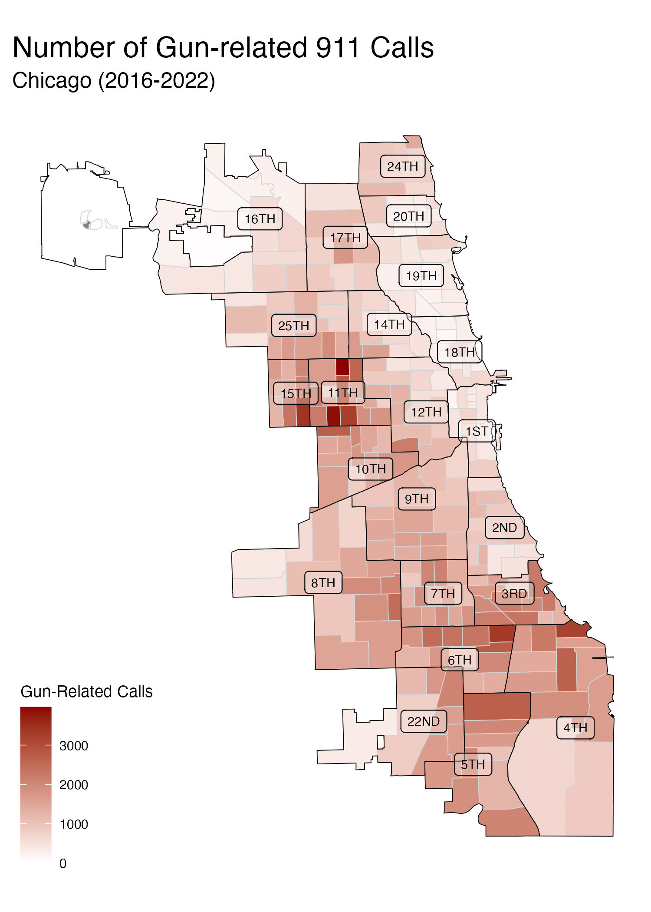
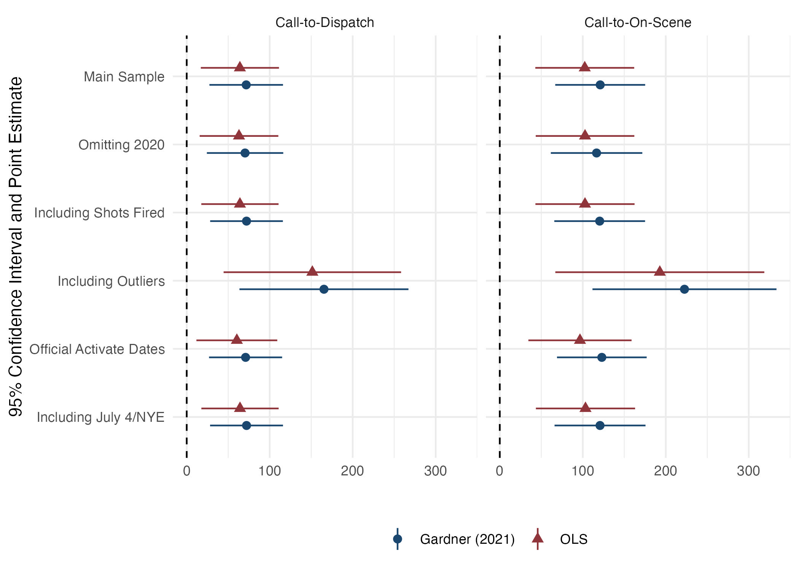

<style type="text/css">
.remark-slide-content {
    font-size: 25px;
    padding: 1em 4em 1em 4em;
}
</style>
```{r setup, include=FALSE}
library(kableExtra)
library(xaringanExtra)
options(htmltools.dir.version = FALSE)
knitr::opts_chunk$set(echo = F,  message = F, warning = F,
                      fig.asp = 9/16,
  fig.align = 'center',
  echo = F,
  out.width = "100%",
  dpi= 300)
# knitr::opts_knit$set(root.dir = rprojroot::find_rstudio_root_file())
```
```{js}
$( document ).ready(function() {
  $(".lightable-classic").removeClass("table").css("display", "table");
});
```


```{css, echo = F}
/* This changes any table of class regression to 20 size font */
.regression table {
  font-size: 20px; 
  width: 100%;
  background-color: transparent;
  border: none;
  border-spacing: unset;
}

table > :is(thead, tbody) > tr > :is(th, td) {
  padding: 3px;
  text-align: left;
  background-color: transparent;
}
table > thead > tr > :is(th, td) {
  border-top: 2px solid;
  border-bottom: 1px solid;
  background-color: white;
}
table > tbody > tr:last-child > :is(th, td) {
  border-bottom: 2px solid;
  background-color: white;
}
table > tfoot > tr > :is(th, td) {
  padding: 0; /* Set padding to 0 for tfoot cells */
  background-color: white;
}

table > tfoot > tr {
  background-color: transparent !important; /* Remove background stripes from tfoot rows */
}


/* This removes the odd-even shade on tables */
.remark-slide thead, .remark-slide tr:nth-child(2n) {
        background-color: white;
    }
```


```{r xaringan-panelset, echo=FALSE}

## this code enables the use of panels inside of the presentation
xaringanExtra::use_panelset()
xaringanExtra::style_panelset_tabs(active_foreground = "blue", background = "white", font_family = "Fira Sans", 
                                   inactive_opacity = 0.5)

```


# Motivation:

.pull-left[
### AI in Police Departments:
  - Substitutes $\rightarrow$ License plate readers, facial recognition 
  - Complements $\rightarrow$ predictive 'hotspot' policing 
  - AI changes officer production function]

--

.pull-right[
### ShotSpotter Technology
  - Gunshot detection
  - Rationale: only 12% of gunfire reported (Carr and Doleac, 2017) $\rightarrow$ method to respond to others 
  - 150+ cities nationwide
]

--

### <font color="blue">**Research Question**</font>: 
### How does the implementation of ShotSpotter technology affect Priority 1 911 call response times?

* How does a police officer's production function change s.t. it affects response?
---
# Why would ShotSpotter affect response times?

.pull-left[
### Resource-Intensive:
  - Respond to every detected gunfire 
  - Chicago: ~70 daily dispatches, 20 min.
  - Priority 1 - equivalent to active shooter
  
### Police Scarcity:
  - Fixed amount of resources $\Rightarrow$ tradeoffs

### Unintended consequences?
 - Does this reallocation affect 911 call response times?


]


.pull-right[

```{r, out.width = "500px", out.height = "450px", fig.align="center"}
knitr::include_graphics("figures/macarthurfigure_attempt.jpg")
```

]

---
# Why do we care about response times?

.font120[
> “If police can arrive within one minute of the commission of an offense, they are more likely to catch the suspect. Any later and the chances of capture are very small, probably less than one in ten.”- (David H. Baley 1996) 
]

--

### Evidence:
- Lower response times results in:
    - Higher crime clearance (Blanes i Vidal and Kirchmaier 2018)
    - Less likelihood of an injury (DeAngelo et al. 2023)
- Response $\rightarrow$ important component of investigation (College of Policing 2013)
- Health implications
    - Delayed treatment $\rightarrow$ worse patient outcomes (Wilde, 2013, Avdic, 2016)


---
# Summary of the Paper:


.pull-left[
## Setting: 
  - Chicago: 2016-2022
    - 2nd largest police force
    - 3rd largest city

]


---
count: false
# Summary of the Paper:


.pull-left[
## Setting: 
  - Chicago: 2016-2022
    - 2nd largest police force
    - 3rd largest city
    
## Data:
 - All dispatched Priority 1 911 calls for police service
  - Police shifts
  - Arrests
  - Victim Injuries
]


---
count: false
# Summary of the Paper:


.pull-left[
## Setting: 
  - Chicago: 2016-2022
    - 2nd largest police force
    - 3rd largest city
    
## Data:
 - All dispatched Priority 1 911 calls for police service
  - Police shifts
  - Arrests
  - Victim Injuries
]


.pull-right[
## Empirical Strategy:
  - Staggered difference-in-differences
    - Variation: ShotSpotter rollouts across police districts
  

]


---
count: false
# Summary of the Paper:


.pull-left[
## Setting: 
  - Chicago: 2016-2022
    - 2nd largest police force
    - 3rd largest city
    
## Data:
 - All dispatched Priority 1 911 calls for police service
  - Police shifts
  - Arrests
  - Victim Injuries
]

.pull-right[
## Empirical Strategy:
  - Staggered difference-in-differences
    - Variation: ShotSpotter rollouts across police districts
  

## Main Results:
  - When a civilian calls 911, a Priority 1 call experiences:
    - +1 minute Call-to-Dispatch (23%)
    - +2 minutes Call-to-On-Scene (13%)
    - Lower arrest probability (8%)
]


---
# Contribution:
### In-depth, causal analysis on the unintended consequences of a wide-spread police technology.

--
#### Related Literature

.panelset.sideways[
.panel[.panel-name[ShotSpotter Specific]
<font color="blue"> We unpack the effects of this wide-spread police technology. </font>
- Economics:
  - Use ShotSpotter as data for alternative crime/mistrust measure (Carr and Doleac 2018; Ang et. al 2021)
- Non-Econonomics: 
  - Better accuracy, little crime impact or case resolution (Piza et al., 2023; Mares and Blackburn, 2012; Choi et al., 2014)
]
.panel[.panel-name[Police Technology]
<font color="blue"> Unlike others, we find costly unintended consequences of a police technology. </font>
- Benefits of Police Technology:
    - Body Worn Cameras $\rightarrow$ lower use of force/complaints (Zamoff et al. 2021; Braga et al. 2022; Ferrazares 2023)
    - Predictive Policing $\rightarrow$ less crime (Mastrobuoni, 2020; Jabri, 2021; Heller et al., 2022)
    - Tactical Equipment $\rightarrow$ less crime (Bove and Gavrilova 2017; Harris et al. 2017))
]

.panel[.panel-name[Rapid Response]
<font color="blue"> We identify a determinant of higher response times, and can quantify at a micro-level. </font>
- Lower Response Times:
  - Higher crime clearance (Blanes i Vidal and Kirchmaier, 2018)
  - Less likelihood of an injury (DeAngelo et al., 2023)
]

.panel[.panel-name[AI in Workforce]
<font color="blue"> The results imply that this artificial intelligence technology cannot replace police officers. </font>
- Substitutes:
  - AI operates better than human managers (Hoffman et al., 2018)
- Complements:
  - Human and algorithmic targeting work best together (Bhatt et al., 2023)
]
]

---
class: inverse, mline, center, middle

# Background on Chicago Policing

---
# Chicago Background:

.pull-left[
### Chicago Geography:
* Chicago subset into 22 police districts (population ~100k)
  - Within districts are beats
  - Officers generally assigned within districts/beats to patrol

### Chicago Crime:
* Chicago crime is localized 
    - Gun-crime is localized to South/West sides
]

.pull-right[
```{r, out.width = "400px", out.height = "500px"}

```
]
---
count: false
# Chicago Background:

.pull-left[
### Chicago Geography:
* Chicago subset into 22 police districts (population ~100k)
  - Within districts are beats
  - Officers generally assigned within districts/beats to patrol

### Chicago Crime:
* Chicago crime is localized 
    - Gun-crime is localized to South/West sides
]

.pull-right[
```{r, out.width = "400px", out.height = "500px"}

```
]
---
# Policing in Chicago:

## Police Officer Responsibilities:
* Patrol, respond to incidents, make arrests/stops, complete written reports
* Gathers info at traffic scenes—preliminary investigation
* Direct traffic
* Appear in court/give testimony

## Police Time Allocation:

> "From the minute you start your shift, radio is non stop calls until backlog. The whole shift you chase radio calls." - CPD Police Officer January 2023 (Indeed.com)

> "Very busy be ready to answer up to 50 calls for service specialy during Summer season." - CPD Police Officer February 2023 (Indeed.com)


---
class: inverse, mline, center, middle

# 911 Dispatch Procedure in Chicago


---
# 911 Dispatch Procedure:

.panelset[

.panel[.panel-name[911 Dispatch Pipeline:]
.center[
.font110[911 call] $\Rightarrow$  .font110[Dispatcher Assigns] $\Rightarrow$  .font110[Officer Travels] $\Rightarrow$  .font110[Officer Arrives]]
]

.panel[.panel-name[Call-to-Dispatch:]

.center[
.font110[<font color = "blue"> <b>911 call </b></font>] $\Large\Rightarrow$  .font110[<font color = "blue"><b>Dispatcher Assigns</b> </font>] $\Large\Rightarrow$  .font110[Officer Travels] $\Large\Rightarrow$  .font110[Officer Arrives]]

#### <font color = "blue"><b>Call-to-Dispatch</b></font>

* Measure of officer availability
]

.panel[.panel-name[Call-to-On-Scene:]
.center[
.font110[<font color = "blue"> <b>911 call </b></font>] $\Large\Rightarrow$  .font110[<font color = "blue"><b>Dispatcher Assigns</b> </font>] $\Large\Rightarrow$  .font110[<font color = "blue"> <b>Officer Travels </b></font>] $\Large\Rightarrow$  .font110[Officer Arrives]]

#### Call-to-Dispatch
* Measure of officer availability

#### <font color = "blue"><b>Call-to-On-Scene</b></font>

* Measure of officer proximity to crime
]
.panel[.panel-name[Arrest Made:]
.center[
.font110[911 call] $\Large\Rightarrow$  .font110[Dispatcher Assigns] $\Large\Rightarrow$  .font110[Officer Travels] $\Large\Rightarrow$  .font110[<font color = "blue"><b>Officer Arrives</b></font>]]

#### Call-to-Dispatch

* Measure of officer availability


#### Call-to-On-Scene

* Measure of officer proximity to crime

#### <font color = "blue"><b>Arrest Made:</b></font>

* Only arrests in the 911 call pipeline: implication of rapid response
]


]

---
# 911 Call Priorities in Chicago:

.pull-left[

### Priority 1 (immediate dispatch):
  - .font80[Imminent threat to life, bodily injury, or major property damage/loss.] 
  - .font80[Example: 'person with gun,' 'domestic battery']

#### Priority 2 (rapid dispatch):
  - .font80[Time-sensitive, no threat to life.]
  - .font80[Example: 'suspicious auto']
  
#### Priority 3 (routine dispatch):
  - .font80[Not time-sensitive.]
  - .font80[Example: 'parking violation']
]

.pull-right[

```{r, out.width = "600px", out.height = "500px"}
knitr::include_graphics("figures/priority_fractions.jpeg")
```
]

---
count: false
# 911 Call Priorities in Chicago:

.pull-left[

### <font color = "blue">Priority 1 (immediate dispatch): </font>
  - <font color = "blue">.font80[Imminent threat to life, bodily injury, or major property damage/loss.] </font>
  - <font color = "blue">.font80[Example: 'person with gun,' 'domestic battery']</font>

#### Priority 2 (rapid dispatch):
  - .font80[Time-sensitive, no threat to life.]
  - .font80[Example: 'suspicious auto']
  
#### Priority 3 (routine dispatch):
  - .font80[Not time-sensitive.]
  - .font80[Example: 'parking violation']
]

.pull-right[

```{r, out.width = "600px", out.height = "500px"}
knitr::include_graphics("figures/priority_fractions.jpeg")
```
]

---
class: inverse, mline, center, middle

# ShotSpotter Technology in Chicago

---
# ShotSpotter Functionality:

```{r, out.width = "850px", out.height = "550px", fig.align="center"}
knitr::include_graphics("libs/figures/shotspot_works.png")
```

---
# ShotSpotter in Chicago:
.pull-left[
### Staggered Rollout
 - .font80[12 of 22 police districts in 2017-2018]
 - .font80[Implemented with full coverage across districts]
 - .font80[Rational: respond to high gun-crime]

### Administrative Background
  - .font80[Priority 1 - same as active shooter]
  - .font80[Same officers responding as 911 call]
  - .font80[Additional: canvass 25 meter radius, add information]
]

.pull-right[
```{r, out.width = "400px", out.height = "500px"}
knitr::include_graphics("figures/map_sst.jpeg")
```

]
---
# ShotSpotter Dispatch Trends (monthly):

```{r, out.width = "850px", out.height = "550px", fig.align="center"}
knitr::include_graphics("figures/shotspotter_trend.jpeg")
```
---
class: inverse, mline, center, middle

# Data and Empirical Strategy

---
name: data
class: regression
# Data and Sample Restrictions:

.pull-left[
### Data Overview:
- Priority 1 911 Calls (2016-2022) with police dispatch
- ShotSpotter dispatches $\neq$ 911 call
- Freedom of Information Act: 25 requests, 100+ emails/phone calls,
1 [lawsuit](#lawsuit) against CPD 


]

.pull-right[
### Sample Restrictions:
- Response time outliers 3+ Std.Dev. from mean (~1.7%)
- Negative response times (.03%)
- Days with celebratory gunfire: 
January 1/July 4/December 31
]

--

```{r, results='asis', echo=FALSE}
xfun::file_string('tables/summary_stats.html')
## put in Summary stats table
```


---

# Estimation Strategy:
### Specification (OLS):

$$\text{ResponseTime}_{cdt} = \beta \text{ShotSpotter}_{dt}  + \eta_{\bar{c}} + \delta_{d} + \gamma\mathbb{X}_{f(t)} +  \varepsilon_{cdt}$$
--

* $\text{ResponseTime}_{cdt}$ is call $c$ in police district $d$ in time $t$.
* $\text{ShotSpotter}_{dt}$ is the binary treatment
* $\eta_{\bar{c}}$ is a call-type fixed effect
* $\delta_{d}$ is a police district-specific fixed effect
* $\mathbb{X}_{f(t)}$ is a vector of time-varying controls:
    - Hour-of-day and day-by-month-by-year
* Standard errors clustered by police district
* <font color="blue"> Intuitively, this is estimating the average change in response times on days with ShotSpotter accounting for expected differences in districts/time/call-types. </font>


---
# Potential Threats to Identification:

--

#### 1. Violation of Common Trends:
  * .font80[Event studies] 
  * .font80[Rambachan and Roth (2023) sensitivity analysis]

--

#### 2. Change in dispatching procedures/call-types post-implementation:
  * .font80[Standard operating procedures same for Priority 1 911 calls]
  * .font80[Specific call-type analysis]

--

#### 3. Other policies that coincide that may affect response times:
  * .font80[Strategic Decision Support Centers (SDSC) and Body-Worn Cameras (BWC)]

--

#### 4. OLS with staggered rollouts:
  * .font80[Two-stage difference-in-differences (Gardner 2021) similar to Borusyak et al. (2021)]

---
class: inverse, mline, center, middle

# Raw-Data Preview 

---
# Raw Data Preview:
```{r, out.width = "850px", out.height = "550px", fig.align="center"}
knitr::include_graphics("figures/raw_evidence_figure.jpeg")
```
---
class: inverse, mline, center, middle

# Results

---
class: regression
# Effect on Call-to-Dispatch (seconds)

```{r,results='asis', echo=FALSE}
xfun::file_string('tables/dispatch_table.html')
```

---
class: regression
count: false
# Effect on Call-to-Dispatch (seconds)

```{r,results='asis', echo=FALSE}
xfun::file_string('tables/dispatch_table_c1.html')
```
---
class: regression
count: false
# Effect on Call-to-Dispatch (seconds)

```{r,results='asis', echo=FALSE}
xfun::file_string('tables/dispatch_table_c2.html')
```
---
class: regression
count: false
# Effect on Call-to-Dispatch (seconds)

```{r,results='asis', echo=FALSE}
xfun::file_string('tables/dispatch_table_c3.html')
```
---
class: regression
# Effect on Call-to-On-Scene (seconds)
```{r,results='asis', echo=FALSE}
xfun::file_string('tables/onscene_table.html')
```
---
class: regression
count: false
# Effect on Call-to-On-Scene (seconds)
```{r,results='asis', echo=FALSE}
xfun::file_string('tables/onscene_table_c1.html')
```
---
class: regression
count: false
# Effect on Call-to-On-Scene (seconds)
```{r,results='asis', echo=FALSE}
xfun::file_string('tables/onscene_table_c2.html')
```

---
class: regression
count: false
# Effect on Call-to-On-Scene (seconds)
```{r,results='asis', echo=FALSE}
xfun::file_string('tables/onscene_table_c3.html')
```

---
class: regression
# Effect on Arrest Likelihood (percent)

```{r,results='asis', echo=FALSE}
xfun::file_string('tables/arrest_table.html')
```
---
class: regression
count: false
# Effect on Arrest Likelihood (percent)

```{r,results='asis', echo=FALSE}
xfun::file_string('tables/arrest_table_pooled_talk.html')
```
---
class: regression
count: false
# Effect on Arrest Likelihood (percent)

```{r,results='asis', echo=FALSE}
xfun::file_string('tables/arrest_table_gun_talk.html')
```
---
class: regression
count: false
# Effect on Arrest Likelihood (percent)

```{r,results='asis', echo=FALSE}
xfun::file_string('tables/arrest_table_type_talk.html')
```

---
# Dynamic Effects: Call-to-Dispatch (seconds)

```{r, out.width = "850px", out.height = "550px", fig.align="center"}
knitr::include_graphics("figures/entry_1_es.jpeg")
```

---
# Dynamic Effects: Call-to-On-Scene (seconds)

```{r, out.width = "850px", out.height = "550px", fig.align="center"}
knitr::include_graphics("figures/eos_1_es.jpeg")
```
---
name: robustness
# Robustness:

## Main Results:
.pull-left[

- Leave-one-out analysis - [See Figure](#loo)
  - Both OLS/Gardner (2021)
- Sample restrictions -  [See Figure](#forest)
  - Omit 2020 (Covid-19) 
  - Omit 'Shots Fired' calls 
  - Reintroduce outliers
  - Reintroduce omitted days
  - Omit never-treated
- For arrests:
  - Logistic regression - [See Figure](#logit)
  ]

.pull-right[

* Control for CPD initatives - [See Table](#confounding_dispatch)
    - Body-Worn Cameras
    - Strategic Decision Support Centers
* Sensitivity analysis - [See Figure](#roth)
    - Rambachan and Roth (2023) 
    - Relax parallel trends
]

---
class: inverse, mline, center, middle

# Mechanism: ShotSpotter Incapacitates Officers


---
# Potential Mechanism: Time Constraint

#### 1. Extensive Margin: Estimate most resource-constrained times 
  - .font80[Split by police-district median number of officer hours]
  - .font80[Separate by shift-type]
    
#### 2. Intensive Margin: Use ShotSpotter dispatches as intensity measure 
  - .font80[Using the number of ShotSpotter dispatches as our identifying variation, we estimate the marginal effect of an extra ShotSpotter dispatch:]

$$\text{ResponseTime}_{cdt} = \beta \text{NumberSSTDispatches}_{dt}  + \eta_{\bar{c}} + \delta_{d} + \gamma\mathbb{X}_{f(t)} +  \varepsilon_{cdt}$$

  - $\text{NumberSSTDispatches}_{dt}$ .font80[is number of ShotSpotter dispatches in a police-district]
  - .font80[Restrict to only treated periods]


---
class: regression
# Extensive Margin: Less Officers (seconds)
```{r,results='asis', echo=FALSE}
xfun::file_string('tables/mechanism_extensive.html')
```
---
count: false
class: regression (seconds)
# Extensive Margin: Less Officers (seconds)
```{r,results='asis', echo=FALSE}
xfun::file_string('tables/mechanism_extensive_pooled.html')
```
---
count: false
class: regression (seconds)
# Extensive Margin: Less Officers (seconds)
```{r,results='asis', echo=FALSE}
xfun::file_string('tables/mechanism_extensive_medians_talk.html')
```


---
# Extensive Margin: Shift Times
```{r, out.width = "1000px", out.height = "550px", fig.align="center"}
knitr::include_graphics("figures/watch_graph.jpeg")
```

---
class: regression
# Intensive Margin: ShotSpotter Dispatches
```{r,results='asis', echo=FALSE}
xfun::file_string('tables/mechanism_intensive.html')
```

---
count: false
class: regression
# Intensive Margin: ShotSpotter Dispatches
```{r,results='asis', echo=FALSE}
xfun::file_string('tables/mechanism_intensive_pooled.html')
```
---
class: regression
count: false
# Intensive Margin: ShotSpotter Dispatches
```{r,results='asis', echo=FALSE}
xfun::file_string('tables/mechanism_intensive_medians.html')
```


---
class: inverse, mline, center, middle

# Heterogeneity 

---
# Two Types of Heterogeneity Analysis:

--

## 1. Analyze specific call-types
  - Analyze specific call-types (call-codes) for the most frequent offenses
  - Large health implications with emergency medical services/domestic calls

--

## 2. Split by priority of call
  - A 'trickle down' effect in Priority 2
      - Suggestive for Priority 3 
  - No time for high priority $\Rightarrow$ no time for lower priorities
  - Lends to the idea that officers are facing more responsibilities than they can handle
      - Incapacitation effect
  

---
# Priority and Call-type Heterogeneity: 


.panelset.sideways[
.panel[.panel-name[Priority 1]
```{r, out.width = "850px", out.height = "550px", fig.align="center"}

```
]


.panel[.panel-name[Priority 2 (Rapid)]
```{r, out.width = "850px", out.height = "550px", fig.align="center"}
knitr::include_graphics("figures/priority_2_graph.jpeg")
```
]

.panel[.panel-name[Priority 3 (Routine)]
```{r, out.width = "850px", out.height = "550px", fig.align="center"}
knitr::include_graphics("figures/priority_3_graph.jpeg")
```
]

]
---
class: inverse, mline, center, middle

# How does ShotSpotter affect 911 injury likelihood?

---
# Does ShotSpotter affect 911 injury likelihood?

## Analysis:

* Analyze the probability of a victim injury on a 911 call
    - Faster response $\Rightarrow$ less injury (DeAngelo et al. 2023)
    
--

## Results: 

* Suggestive (not conclusive!) evidence of lower injury probability for gun-related calls
    - ShotSpotter may corroborate gun-related 911 calls
    - Provide more intelligence
* No effect on non-gun-related calls
    - Cannot rule out increases

---
class: regression
# Effect on Victim Injury Likelihood (percent):
```{r,results='asis', echo=FALSE}
xfun::file_string('tables/victim_table.html')
```
---
count: false
class: regression
# Effect on Victim Injury Likelihood (percent):
```{r,results='asis', echo=FALSE}
xfun::file_string('tables/victim_table_pooled.html')
```
---
count: false
class: regression
# Effect on Victim Injury Likelihood (percent):
```{r,results='asis', echo=FALSE}
xfun::file_string('tables/victim_table_gun.html')
```

---
# Conclusion:

## Contribution:
- An in-depth analysis on unintended consequences of ShotSpotter
- Find a determinant of response times

## Main Findings: Longer Response
- Call-to-Dispatch (+1 minute/ 23%)/ Call-to-On-Scene (+2 minutes/ 13%)
    - Longer response times $\Rightarrow$ lower arrest likelihood  (8% decrease)
    
## Mechanism: Incapacitation

- More officers needed to mitigate unintended consequences
- Back-of-the-evelope: 2x more officers needed


---
class: inverse, mline, center, middle

# Thank you

---
name: lawsuit
# Lawsuit
```{r, out.width = "500px", out.height = "500px", fig.align="center"}

```
[Back to Data](#data)
---
name: loo
# Leave-one-out

```{r, out.width = "700px", out.height = "500px", fig.align="center"}
knitr::include_graphics("appendix_figures/loo.jpeg")
```


[Back to Robustness](#robustness)

---
name: forest
# Robustness Across Samples

```{r, out.width = "700px", out.height = "500px", fig.align="center"}

```


[Back to Robustness](#robustness)

---
class: regression
name: logit
# Effect on Arrest Likelihood (Logit)

```{r,results='asis', echo=FALSE}
xfun::file_string('tables/arrest_table_logit.html')
```

[Back to Robustness](#robustness)

---
class: regression
name: confounding_dispatch
# Controlling for BWC and SDSC (Dispatch)

```{r,results='asis', echo=FALSE}
xfun::file_string('tables/confounding_table_dispatch.html')
```


---
class: regression
name: confounding_onscene
# Controlling for BWC and SDSC (On-Scene)

```{r,results='asis', echo=FALSE}
xfun::file_string('tables/confounding_table_onscene.html')
```

---
name: roth
# Rambachan and Roth 2023: Sensitivity Analysis

```{r, out.width = "700px", out.height = "500px", fig.align="center"}
knitr::include_graphics("appendix_figures/roth_trends_dispatch.jpeg")
```
[Back to Robustness](#robustness)
---
# Rambachan and Roth 2023: Sensitivity Analysis

```{r, out.width = "700px", out.height = "500px", fig.align="center"}
knitr::include_graphics("appendix_figures/roth_trends_onscene.jpeg")
```
[Back to Robustness](#robustness)