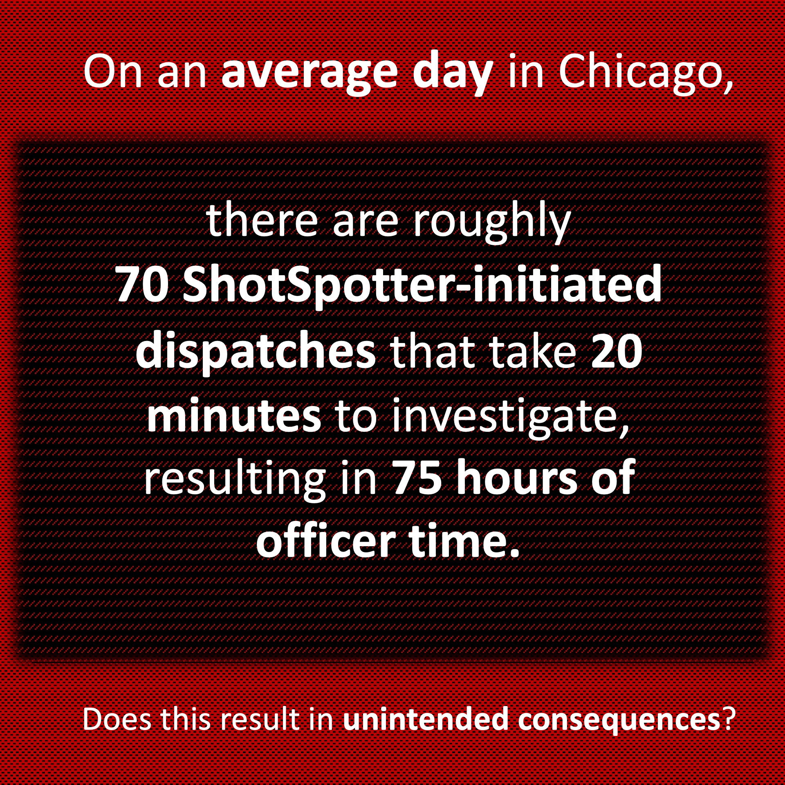

<style type="text/css">
.remark-slide-content {
    font-size: 25px;
    padding: 1em 4em 1em 4em;
}
</style>
```{r setup, include=FALSE}
library(kableExtra)
library(xaringanExtra)
options(htmltools.dir.version = FALSE)
knitr::opts_chunk$set(echo = F,  message = F, warning = F,
                      fig.asp = 9/16,
  fig.align = 'center',
  echo = F,
  out.width = "100%",
  dpi= 300)
# knitr::opts_knit$set(root.dir = rprojroot::find_rstudio_root_file())
```
```{js}
$( document ).ready(function() {
  $(".lightable-classic").removeClass("table").css("display", "table");
});
```


```{css, echo = F}

.red {
  font-weight: bold;
  color: red;
}
/* This changes any table of class regression to 20 size font */
.regression table {
  font-size: 20px; 
  width: 100%;
  background-color: transparent;
  border: none;
  border-spacing: unset;
}

table > :is(thead, tbody) > tr > :is(th, td) {
  padding: 3px;
  text-align: left;
  background-color: transparent;
}
table > thead > tr > :is(th, td) {
  border-top: 2px solid;
  border-bottom: 1px solid;
  background-color: white;
}
table > tbody > tr:last-child > :is(th, td) {
  border-bottom: 2px solid;
  background-color: white;
}
table > tfoot > tr > :is(th, td) {
  padding: 0; /* Set padding to 0 for tfoot cells */
  background-color: white;
}

table > tfoot > tr {
  background-color: transparent !important; /* Remove background stripes from tfoot rows */
}


/* This removes the odd-even shade on tables */
.remark-slide thead, .remark-slide tr:nth-child(2n) {
        background-color: white;
    }
```


```{r xaringan-panelset, echo=FALSE}

## this code enables the use of panels inside of the presentation
xaringanExtra::use_panelset()
xaringanExtra::style_panelset_tabs(active_foreground = "blue", background = "white", font_family = "Fira Sans", 
                                   inactive_opacity = 0.5)

```


# Research Introduction

### ShotSpotter Technology
  - Gunshot detection
  - Rationale: only 12% of gunfire reported (Carr and Doleac, 2017) $\rightarrow$ method to rapidly respond to others 
  - 150+ cities world-wide

--

### <font color="blue">**Research Question**</font>: 
### How does the implementation of ShotSpotter technology affect 911 call response times?

* How does a police officer's scarce resource of time change? Will this affects their ability to rapidly respond to 911 calls? We study **Chicago**.

---
# ShotSpotter Functionality

```{r, out.width = "850px", out.height = "550px", fig.align="center"}
knitr::include_graphics("libs/figures/shotspot_works.png")
```
---
# Why would ShotSpotter affect response times?

.pull-left[
### Resource-Intensive
  - Respond to every detected gunfire 
  - **Chicago**: ~70 daily dispatches, 20 min.
  - High priority: same as active shooter
  
### Police Scarcity
  - Fixed resources $\Rightarrow$ trade-offs

### Higher or Lower Response Times?
 - Does proximity or time allocation prevail?


]


.pull-right[

```{r, out.width = "500px", out.height = "450px", fig.align="center"}

```

]

---
# Why do we care about response times?

.font120[
> “If police can arrive within one minute of the commission of an offense, they are more likely to catch the suspect. Any later and the chances of capture are very small, probably less than one in ten.”- (David H. Baley 1996) 
]

--

### Evidence
- Lower response times results in
    - Higher crime clearance (Blanes i Vidal and Kirchmaier 2018)
    - Less likelihood of an injury (DeAngelo et al. 2023)
- Rapid response $\rightarrow$ important component of investigation (College of Policing 2013)
- Health implications
    - Delayed treatment $\rightarrow$ worse patient outcomes (Wilde, 2013, Avdic, 2016)

---
# Summary of the Paper
.pull-left[
### What is the natural experiment?
 - .font80[Some police districts get the tech, others do not.]
 - .font80[Compare the trends on days with ShotSpotter to those without.]

### Data
 - .font80[All 911 calls in Chicago from 2016-2022]
 
### Main Findings
  - .font80[Increases in rapid response time by ~2 minutes!]
  - .font80[Less likelihood of arresting perpetrators because of this delay]
]

.pull-right[
```{r, out.width = "400px", out.height = "500px"}
knitr::include_graphics("figures/map_sst.jpeg")
```

]

---
class: inverse, mline, center, middle

# If ShotSpotter was to come to your city, would you want it implemented?


---
# Reviewing Learning Objectives

--

### What does an Applied Micro Economist do generally?

--

<font color="red">**Potential Response:**</font> Attempts to find a causal relationship between X and Y.

--

### What is the Economics of Crime?

--

<font color="red">**Potential Response:**</font> Studying causal relationships with crime as an outcome.

--

### What types of questions do crime economists answer?

--

<font color="red">**Potential Response:**</font> How does ShotSpotter Technology affect police response times?

--

### How do crime economists get crime data?

--

<font color="red">**Potential Response:**</font> Freedom of Information Acts.


