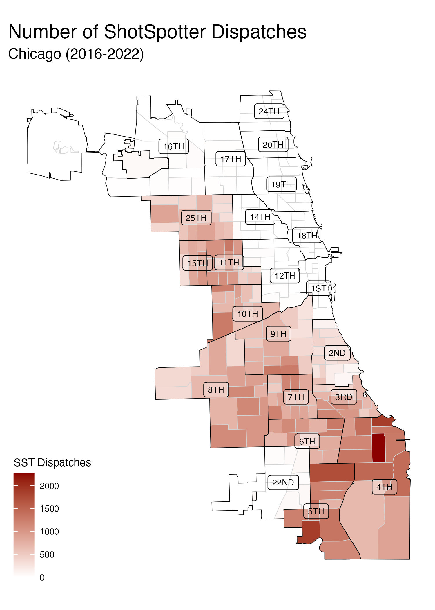
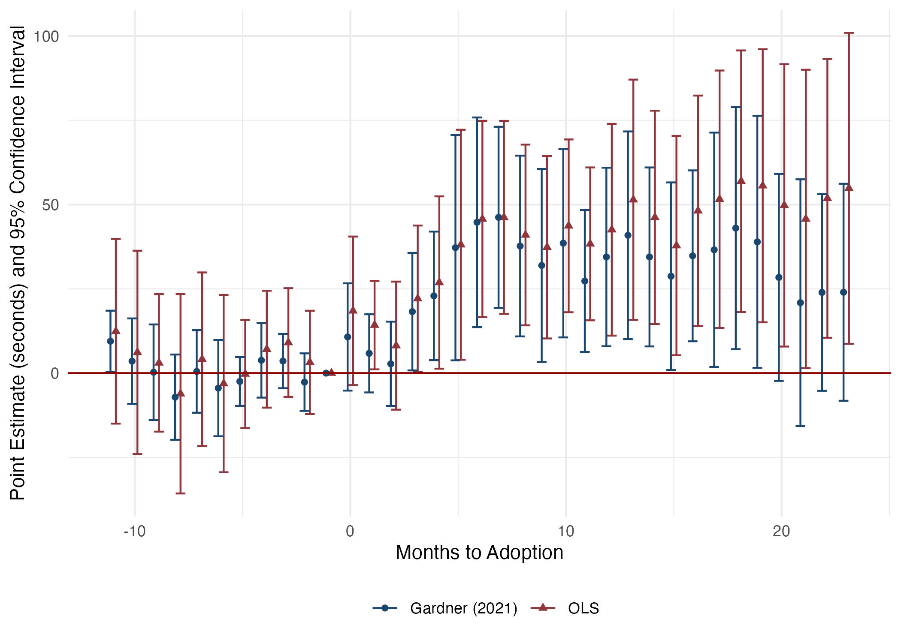
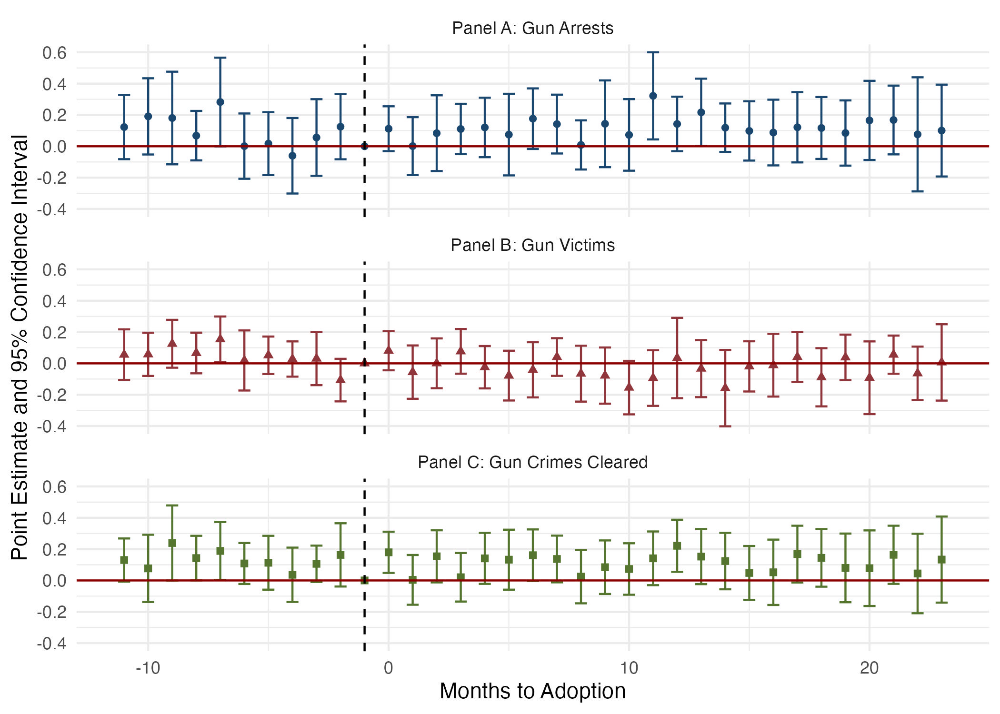

<style type="text/css">
.remark-slide-content {
    font-size: 25px;
    padding: 1em 4em 1em 4em;
}
</style>
```{r setup, include=FALSE}
library(kableExtra)
library(xaringanExtra)
options(htmltools.dir.version = FALSE)
knitr::opts_chunk$set(echo = F,  message = F, warning = F,
                      fig.asp = 9/16,
  fig.align = 'center',
  echo = F,
  out.width = "100%",
  dpi= 300)
# knitr::opts_knit$set(root.dir = rprojroot::find_rstudio_root_file())
```
```{js}
$( document ).ready(function() {
  $(".lightable-classic").removeClass("table").css("display", "table");
});
```


```{css, echo = F}

.red {
  font-weight: bold;
  color: red;
}
/* This changes any table of class regression to 20 size font */
.regression table {
  font-size: 20px; 
  width: 100%;
  background-color: transparent;
  border: none;
  border-spacing: unset;
}

table > :is(thead, tbody) > tr > :is(th, td) {
  padding: 3px;
  text-align: left;
  background-color: transparent;
}
table > thead > tr > :is(th, td) {
  border-top: 2px solid;
  border-bottom: 1px solid;
  background-color: white;
}
table > tbody > tr:last-child > :is(th, td) {
  border-bottom: 2px solid;
  background-color: white;
}
table > tfoot > tr > :is(th, td) {
  padding: 0; /* Set padding to 0 for tfoot cells */
  background-color: white;
}

table > tfoot > tr {
  background-color: transparent !important; /* Remove background stripes from tfoot rows */
}


/* This removes the odd-even shade on tables */
.remark-slide thead, .remark-slide tr:nth-child(2n) {
        background-color: white;
    }
```


```{r xaringan-panelset, echo=FALSE}

## this code enables the use of panels inside of the presentation
xaringanExtra::use_panelset()
xaringanExtra::style_panelset_tabs(active_foreground = "blue", background = "white", font_family = "Fira Sans", 
                                   inactive_opacity = 0.5)

```


# Motivation

.pull-left[
### Technology in Police Departments:
  - Substitutes $\rightarrow$ License plate readers, facial recognition 
  - Complements $\rightarrow$ predictive 'hotspot' policing 
  - Technology changes officer time allocation]

--

.pull-right[
### ShotSpotter Technology
  - Gunshot detection
  - Rationale: only 12% of gunfire reported (Carr and Doleac, 2017) $\rightarrow$ method to rapidly respond to others 
  - 150+ cities world-wide
]

--

### <font color="blue">**Research Question**</font>: 
### How does the implementation of ShotSpotter technology affect 911 call response times?

* How does a police officer's time allocation change s.t. it affects response?
---
# Why would ShotSpotter affect response times?

.pull-left[
### Resource-Intensive
  - Chicago: ~70 daily dispatches, 20 min.
  - High priority: same as active shooter
  - Ineffective crime tool .font80[(Connealy et al., 2024; Ferguson and Witzburg, 2021; Manes, 2021)]
  
### Police Scarcity
  - Fixed resources $\Rightarrow$ trade-offs

### Unintended consequences?
 - Ex-ante ambigious; does proximity or time allocation prevail?


]


.pull-right[

```{r, out.width = "500px", out.height = "450px", fig.align="center"}
knitr::include_graphics("figures/macarthurfigure_attempt.jpg")
```

]

---
# Why do we care about response times?

.font120[
> “If police can arrive within one minute of the commission of an offense, they are more likely to catch the suspect. Any later and the chances of capture are very small, probably less than one in ten.”- (David H. Baley 1996) 
]

--

### Evidence
- Lower response times results in
    - Higher crime clearance (Blanes i Vidal and Kirchmaier 2018)
    - Less likelihood of an injury (DeAngelo et al. 2023)
- Rapid response $\rightarrow$ important component of investigation (College of Policing 2013)
- Health implications
    - Delayed treatment $\rightarrow$ worse patient outcomes (Wilde, 2013, Avdic, 2016)


---
# Summary of the Paper


.pull-left[
## Setting:
  - Chicago: 2016-2022
    - 2nd largest police force
    - 3rd largest city

]


---
count: false
# Summary of the Paper


.pull-left[
## Setting: 
  - Chicago: 2016-2022
    - 2nd largest police force
    - 3rd largest city
    
## Data:
 - All dispatched 911 calls for police service
  - Police shifts
  - Arrests
  - Gun-related victimization/clearance
]


---
count: false
# Summary of the Paper


.pull-left[
## Setting: 
  - Chicago: 2016-2022
    - 2nd largest police force
    - 3rd largest city
    
## Data:
 - All dispatched 911 calls for police service
  - Police shifts
  - Arrests
  - Gun-related victimization/clearance
]


.pull-right[
## Empirical Strategy:
  - Staggered difference-in-differences
    - Variation: ShotSpotter rollouts across police districts
  

]


---
count: false
# Summary of the Paper


.pull-left[
## Setting: 
  - Chicago: 2016-2022
    - 2nd largest police force
    - 3rd largest city
    
## Data:
 - All dispatched 911 calls for police service
  - Police shifts
  - Arrests
  - Gun-related victimization/clearance
]

.pull-right[
## Empirical Strategy:
  - Staggered difference-in-differences
    - Variation: ShotSpotter rollouts across police districts
  

## Main Results:
  - When a civilian calls 911, a call experiences:
    - +1 minute Call-to-Dispatch (23%)
    - +2 minutes Call-to-On-Scene (13%)
    - Lower arrest probability (9%)
  - No benefits outside 911 system
]

---
# Contribution
### In-depth, causal analysis on the unintended consequences of a wide-spread police technology.

--
#### Related Literature

.panelset.sideways[
.panel[.panel-name[ShotSpotter Specific]
<font color="blue"> We unpack the effects of this wide-spread police technology. </font>
- Economics:
  - Use ShotSpotter as data for alternative crime/mistrust measure (Carr and Doleac 2018; Ang et. al 2021)
- Non-Economics: 
  - Better accuracy, little crime impact or case resolution (Piza et al., 2023; Mares and Blackburn, 2012; Choi et al., 2014)
]
.panel[.panel-name[Police Technology]
<font color="blue"> Unlike others, we find costly unintended consequences of a police technology. </font>
- Benefits of Police Technology:
    - Body Worn Cameras $\rightarrow$ lower use of force/complaints (Zamoff et al. 2021; Braga et al. 2022; Ferrazares 2023)
    - Predictive Policing $\rightarrow$ less crime (Mastrobuoni, 2020; Jabri, 2021; Heller et al., 2022)
    - Tactical Equipment $\rightarrow$ less crime (Bove and Gavrilova 2017; Harris et al. 2017))
]

.panel[.panel-name[Rapid Response]
<font color="blue"> We identify a determinant of higher response times, and can quantify at a micro-level. </font>
- Lower Response Times:
  - Higher crime clearance (Blanes i Vidal and Kirchmaier, 2018)
  - Less likelihood of an injury (DeAngelo et al., 2023)
]

.panel[.panel-name[Technology in Workforce]
<font color="blue"> The results imply that technology should be rigorously evaluated prior to implementation. </font>
- General Workforce Productivity:
  - Technology is an effective workforce tool (Hoffman et al., 2018, Bhatt et al., 2023)
- Implementation and Allocation:
  - *How* resources allocated $\rightarrow$ important for desired outcomes (Ba et al., 2021; Kapustin et al., 2022a; Rivera and Ba, 2023; Adger et al., 2023)
]
]


---
class: inverse, mline, center, middle

# 911 Dispatch Procedure in Chicago


---
# 911 Dispatch Procedure

.panelset[

.panel[.panel-name[911 Dispatch Pipeline:]
.center[
.font110[911 call] $\Rightarrow$  .font110[Dispatcher Assigns] $\Rightarrow$  .font110[Officer Travels] $\Rightarrow$  .font110[Officer Arrives]]
]

.panel[.panel-name[Call-to-Dispatch:]

.center[
.font110[<font color = "blue"> <b>911 call </b></font>] $\Large\Rightarrow$  .font110[<font color = "blue"><b>Dispatcher Assigns</b> </font>] $\Large\Rightarrow$  .font110[Officer Travels] $\Large\Rightarrow$  .font110[Officer Arrives]]

#### <font color = "blue"><b>Call-to-Dispatch</b></font>

* Measure of officer availability; officers label themselves as 'available'
]

.panel[.panel-name[Call-to-On-Scene:]
.center[
.font110[<font color = "blue"> <b>911 call </b></font>] $\Large\Rightarrow$  .font110[<font color = "blue"><b>Dispatcher Assigns</b> </font>] $\Large\Rightarrow$  .font110[<font color = "blue"> <b>Officer Travels </b></font>] $\Large\Rightarrow$  .font110[Officer Arrives]]

#### Call-to-Dispatch
* Measure of officer availability; officers label themselves as 'available'

#### <font color = "blue"><b>Call-to-On-Scene</b></font>

* Measure of officer proximity to crime
]
.panel[.panel-name[Arrest Made:]
.center[
.font110[911 call] $\Large\Rightarrow$  .font110[Dispatcher Assigns] $\Large\Rightarrow$  .font110[Officer Travels] $\Large\Rightarrow$  .font110[<font color = "blue"><b>Officer Arrives</b></font>]]

#### Call-to-Dispatch

* Measure of officer availability; officers label themselves as 'available'


#### Call-to-On-Scene

* Measure of officer proximity to crime

#### <font color = "blue"><b>Arrest Made:</b></font>

* Only arrests in the 911 call pipeline: implication of rapid response
]


]

---
# 911 Call Priorities in Chicago

.pull-left[

### Priority 1 (immediate dispatch):
  - .font80[Imminent threat to life, bodily injury, or major property damage/loss.] 
  - .font80[Example: 'person with gun,' 'domestic battery']

#### Priority 2 (rapid dispatch):
  - .font80[Time-sensitive, no threat to life.]
  - .font80[Example: 'suspicious auto']
  
#### Priority 3 (routine dispatch):
  - .font80[Not time-sensitive.]
  - .font80[Example: 'parking violation']
]

.pull-right[

```{r, out.width = "600px", out.height = "500px"}

```
]

---
count: false
# 911 Call Priorities in Chicago

.pull-left[

### <font color = "blue">Priority 1 (immediate dispatch): </font>
  - <font color = "blue">.font80[Imminent threat to life, bodily injury, or major property damage/loss.] </font>
  - <font color = "blue">.font80[Example: 'person with gun,' 'domestic battery']</font>

#### Priority 2 (rapid dispatch):
  - .font80[Time-sensitive, no threat to life.]
  - .font80[Example: 'suspicious auto']
  
#### Priority 3 (routine dispatch):
  - .font80[Not time-sensitive.]
  - .font80[Example: 'parking violation']
]

.pull-right[

```{r, out.width = "600px", out.height = "500px"}

```
]

---
class: inverse, mline, center, middle

# ShotSpotter Technology in Chicago

---
# ShotSpotter Functionality

```{r, out.width = "850px", out.height = "550px", fig.align="center"}

```

---
# ShotSpotter in Chicago
.pull-left[
### Staggered Rollout
 - .font80[12 of 22 police districts in 2017-2018]
 - .font80[Implemented with full coverage across districts]
 - .font80[Rational: respond to high gun-crime]

### Administrative Background
  - .font80[Priority 1 - same as active shooter]
  - .font80[Same officers responding as 911 call]
  - .font80[Additional: canvass 25 meter radius, add information]
]

.pull-right[
```{r, out.width = "400px", out.height = "500px"}

```

]
---
# ShotSpotter Dispatch Trends (monthly)

```{r, out.width = "850px", out.height = "550px", fig.align="center"}

```
---
class: inverse, mline, center, middle

# Data and Empirical Strategy

---
name: data
class: regression
# Data and Sample Restrictions

.pull-left[
### Data Overview:
- Priority 1 911 Calls (2016-2022) with police dispatch
- .red[ShotSpotter dispatches] $\neq$ .red[911 call]
- Freedom of Information Act: 25 requests, 100+ emails/phone calls,
1 [lawsuit](#lawsuit) against CPD 


]

.pull-right[
### Sample Restrictions:
- Response time outliers 3+ Std.Dev. from mean (~1.7%)
- Negative response times (.03%)
- Days with celebratory gunfire: 
January 1/July 4/December 31
- Omit `Shots Fired' calls
]

--

```{r, results='asis', echo=FALSE}
xfun::file_string('tables/summary_stats.html')
## put in Summary stats table
```

---
class: regression
# Data and Sample Restrictions

.pull-left[
### Data Overview:
- Priority 1 911 Calls (2016-2022) with police dispatch
- .red[ShotSpotter dispatches] $\neq$ .red[911 call]
- Freedom of Information Act: 25 requests, 100+ emails/phone calls,
1 [lawsuit](#lawsuit) against CPD 


]

.pull-right[
### Sample Restrictions:
- Response time outliers 3+ Std.Dev. from mean (~1.7%)
- Negative response times (.03%)
- Days with celebratory gunfire: 
January 1/July 4/December 31
- Omit `Shots Fired' calls
]


```{r, results='asis', echo=FALSE}
xfun::file_string('tables/summary_stats_n.html')
## put in Summary stats table
```


---

# Estimation Strategy
### Specification (OLS):

$$\text{ResponseTime}_{cdt} = \beta \text{ShotSpotterActivated}_{dt}  + \eta_{\bar{c}} + \delta_{d} + \gamma\mathbb{X}_{f(t)} +  \varepsilon_{cdt}$$
--

* $\text{ResponseTime}_{cdt}$ is call $c$ in police district $d$ in time $t$.
* $\text{ShotSpotterActivated}_{dt}$ is the binary treatment
* $\eta_{\bar{c}}$ is a call-type fixed effect
* $\delta_{d}$ is a police district-specific fixed effect
* $\mathbb{X}_{f(t)}$ is a vector of time-varying controls:
    - Hour-of-day and day-by-month-by-year
* Standard errors clustered by police district
* <font color="blue"> Intuitively, estimation of parameter $\beta$ gives the average change in response times on days with ShotSpotter accounting for expected differences in districts/time/call-types. </font>


---
name: assumptions
# Potential Threats to Identification

--

#### 1. Response times increasing prior to rollout:
  * .font80[Event studies - tests plausibility] 
  * .font80[Rambachan and Roth (2023) [sensitivity analysis](#roth)]

--

#### 2. Change in dispatching procedures/call-types post-implementation:
  * .font80[Standard operating procedures same for Priority 1 911 calls]
  * .font80[No change in call volume + [composition test](#composition)]

--

#### 3. Other policies that coincide that may affect response times:
  * .font80[[Strategic Decision Support Centers (SDSC)](#confounding_dispatch) and [Body-Worn Cameras (BWC)](#confounding_dispatch)]

--

#### 4. OLS with staggered rollouts:
  * .font80[Two-stage difference-in-differences (Gardner 2021) similar to Borusyak et al. (2021)]

---
class: inverse, mline, center, middle

# Results

---
class: regression
# Effect on Response Times (seconds)

```{r,results='asis', echo=FALSE}
xfun::file_string('tables/response_time_table.html')
```

---
class: regression
count: false
# Effect on Response Times (seconds)

```{r,results='asis', echo=FALSE}
xfun::file_string('tables/response_time_table_c1.html')
```

---
class: regression
count: false
# Effect on Response Times (seconds)

```{r,results='asis', echo=FALSE}
xfun::file_string('tables/response_time_table_c2.html')
```

---
class: regression
count: false
# Effect on Response Times (seconds)

```{r,results='asis', echo=FALSE}
xfun::file_string('tables/response_time_table_c3.html')
```
---
class: regression
count: false
# Effect on Response Times (seconds)

```{r,results='asis', echo=FALSE}
xfun::file_string('tables/response_time_table_c4.html')
```

---
class: regression
count: false
# Effect on Response Times (seconds)

```{r,results='asis', echo=FALSE}
xfun::file_string('tables/response_time_table_r1.html')
```


---
class: regression
count: false
# Effect on Response Times (seconds)

```{r,results='asis', echo=FALSE}
xfun::file_string('tables/response_time_table_r2.html')
```


---
class: regression
# Effect on 911 Call Resolutions (percent)

```{r,results='asis', echo=FALSE}
xfun::file_string('tables/arrest_table.html')
```
---
class: regression
count: false
# Effect on 911 Call Resolutions (percent)

```{r,results='asis', echo=FALSE}
xfun::file_string('tables/arrest_table_pooled_talk.html')
```

---
class: regression
count: false
# Effect on 911 Call Resolutions (percent)

```{r,results='asis', echo=FALSE}
xfun::file_string('tables/arrest_table_type_talk.html')
```

---
# Dynamic Effects: Call-to-Dispatch (seconds)

```{r, out.width = "850px", out.height = "550px", fig.align="center"}

```

---
# Dynamic Effects: Call-to-On-Scene (seconds)

```{r, out.width = "850px", out.height = "550px", fig.align="center"}
knitr::include_graphics("figures/eos_1_es.jpeg")
```

---
class: inverse, mline, center, middle

# Mechanism: Resource Constraint of Police Officers


---
# Mechanism: Resource Constraint

#### 1. Extensive Margin: Estimate most resource-constrained times 
  - .font80[Separate by shift-type]
  - .font80[Split by police-district median number of officer hours (see paper)]

    
#### 2. Intensive Margin: Use ShotSpotter dispatches as intensity measure (see paper)
  - .font80[Using the number of ShotSpotter dispatches as our identifying variation, we estimate the marginal effect of an extra ShotSpotter dispatch:]

$$\text{ResponseTime}_{dt} = \beta \text{NumberSSTDispatches}_{dt} + \delta_{d} + \gamma_t +  \varepsilon_{dt}$$

  - $\text{NumberSSTDispatches}_{dt}$ .font80[is number of ShotSpotter dispatches in a police-district]
  - .font80[Restrict to only treated periods]
  - .font80[6 (8) second increase per dispatch for Call-to-Dispatch (On-Scene)]


---
# Extensive Margin: Shift Times
```{r, out.width = "1000px", out.height = "550px", fig.align="center"}

```


---
class: inverse, mline, center, middle

# Is ShotSpotter an Effective Gun-Violence Reduction Tool?

---
# Effective Gun-Violence Reduction?

### <font color="blue">**Are there benefits that outweigh the costs?**</font> 

#### 1. Use aggregate-level counts of gun-related arrests/victimization/clearance 
  - Event-study analysis (Poisson Regression)
  - Little evidence of ShotSpotter reductions $\rightarrow$ no clear 1st order benefit
    - Corrobates with other Chicago studies  (Connealy et al., 2024; Ferguson and Witzburg, 2021; Manes, 2021)

#### 2. Productivity of ShotSpotter Dispatch vs. Gun-related 911 Calls
  - Descriptively compare arrest likelihoods
  - Data limitations: 2019-2022 (post-rollout)
  - <font color="red">2.2%</font> of ShotSpotter end in arrests, <font color="red">3.5%</font> of 911 calls (pre-rollout) 
  
---
# Event Study: Gun-related Outcomes (Poisson)
```{r, out.width = "850px", out.height = "550px", fig.align="center"}

```
---
# Conclusion

## Contribution:
- An in-depth analysis on unintended consequences of ShotSpotter
- Workforce techology: prior evaluation for desired outcomes

## Main Findings: Longer Response
- Call-to-Dispatch (+1 minute/ 23%)/ Call-to-On-Scene (+2 minutes/ 13%)
    - Longer response times $\Rightarrow$ lower arrest likelihood  (9% decrease)
    
## Mechanism: Resource Constraint

- More officers needed to mitigate unintended consequences


---
class: inverse, mline, center, middle

# Thank you

---
name: lawsuit
# Lawsuit
```{r, out.width = "500px", out.height = "500px", fig.align="center"}
knitr::include_graphics("figures/lawsuit.png")
```
[Back to Data](#data)
---
name: loo
# Leave-one-out

```{r, out.width = "700px", out.height = "500px", fig.align="center"}

```


[Back to Robustness](#robustness)

---
name: forest
# Robustness Across Samples

```{r, out.width = "700px", out.height = "500px", fig.align="center"}
knitr::include_graphics("appendix_figures/forest_sample_plot.jpeg")
```


[Back to Robustness](#robustness)

---
class: regression
name: logit
# Effect on Arrest Likelihood (Logit)

```{r,results='asis', echo=FALSE}
xfun::file_string('tables/arrest_table_logit.html')
```

[Back to Robustness](#robustness)

---
class: regression
name: confounding_dispatch
# Controlling for BWC and SDSC (Dispatch)

```{r,results='asis', echo=FALSE}
xfun::file_string('tables/confounding_table_dispatch.html')
```


---
class: regression
name: confounding_onscene
# Controlling for BWC and SDSC (On-Scene)

```{r,results='asis', echo=FALSE}
xfun::file_string('tables/confounding_table_onscene.html')
```

---
name: roth
# Rambachan and Roth 2023: Sensitivity Analysis

```{r, out.width = "700px", out.height = "500px", fig.align="center"}
knitr::include_graphics("appendix_figures/roth_trends_dispatch.jpeg")
```
[Back to Robustness](#assumptions)
---
# Rambachan and Roth 2023: Sensitivity Analysis

```{r, out.width = "700px", out.height = "500px", fig.align="center"}

```
[Back to Robustness](#assumptions)

---
name: composition
# Call Composition Test: FDR P-values

```{r, out.width = "700px", out.height = "500px", fig.align="center"}

```
[Back to Assumptions](#assumptions)

